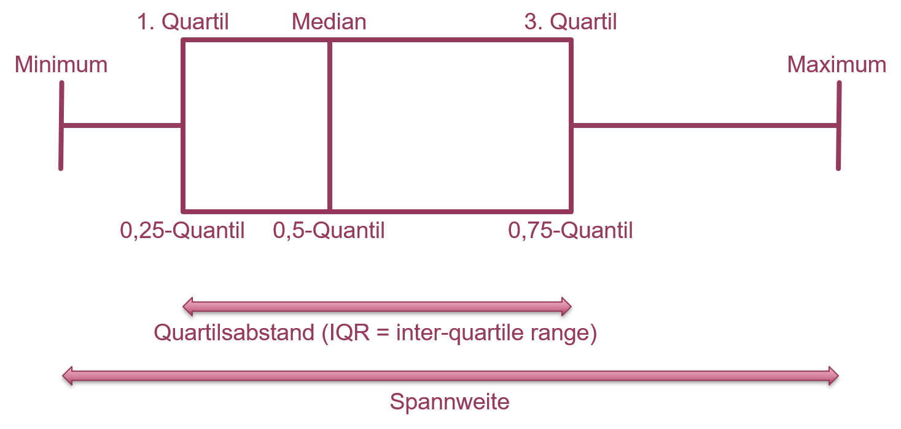

# Streuungsparameter, Schiefe und Wölbung {#streuung}

## Streuungsparameter

Lesen Sie dazu bitte Kapitel 3.2.3 von @zimmermann2014.

**Streuungsparameter** sind Maße der Variabilität einer Häufigkeitsverteilung. Uns interessieren hier v.a. **Spannweite**, **Quartilsabstand**, **Varianz und Standardabweichung** und **Variationskoeffizient**, weniger durchschnittliche absolute Abweichung, da wir letztere kaum in der Praxis sehen.

Spannweite und Quartilsabstand lassen sich am besten mit einem sogenannten Box-Whisker-Plot, kurz einfach **Boxplot**, verdeutlichen (Abbildung \@ref(fig:boxplot)). Ein Boxplot fasst die Verteilung der Werte eines Merkmals (in einer Stichprobe) zusammen. Die **Spannweite** ist der Abstand zwischen Minimum und Maximum der Merkmalswerte. Der **Quartilsabstand** ist der Abstand zwischen 0.25-Quantil und 0.75-Quantil; in diesem Bereich liegen 50% der Merkmalswerte (0.75 - 0.25). 0.25-Quantil, 0.5-Quantil (Median) und 0.75-Quantil heißen auch 1., 2. und 3. Quartil, weil sie den Wertebereich in vier gleichgroße Teile teilen: zwischen Minimum und 0.25-Quantil liegen 25% der Merkmalswerte, zwischen 0.25-Quantil und Median 25%, zwischen Median und 0.75-Quantil 25% und zwischen 0.75-Quantil und Maximum ebenfalls 25% aller Merkmalswerte. Ebenso gibt es auch Quintile usw., diese sind aber in der Praxis kaum von Bedeutung. Ein Boxplot kann horizontal (wie hier) und vertikal dargestellt werden.


```{r boxplot, echo=FALSE, fig.align='center', message = FALSE, fig.cap='Boxplot mit Quartilsabstand und Spannweite.', out.width='80%'}
# 
library(tidyverse)
set.seed(1)
rbeta(10000,2,3) %>% 
  as_tibble() %>% 
  ggplot(aes(x = value)) +
  stat_boxplot(geom ='errorbar', width = 0.2, col = "violetred4", size = 2) +
  geom_boxplot(col = "violetred4", size = 2, width = 0.4)  +
  annotate(geom="text", x=0.955, y=0.15, label="Maximum",
           color="violetred4", size = 5) +
  annotate(geom="text", x=0.01, y=0.15, label="Minimum",
           color="violetred4", size = 5) +
  annotate(geom="text", x=0.38, y=0.25, label="Median",
           color="violetred4", size = 5) +
  annotate(geom="text", x=0.2, y=0.25, label="1. Quartil",
           color="violetred4", size = 5) +
  annotate(geom="text", x=0.55, y=0.25, label="3. Quartil",
           color="violetred4", size = 5) +
  annotate(geom="text", x=0.2, y=-0.25, label="0,25-Quantil",
           color="violetred4", size = 5) +
  annotate(geom="text", x=0.38, y=-0.25, label="0,5-Quantil",
           color="violetred4", size = 5) +
  annotate(geom="text", x=0.55, y=-0.25, label="0,75-Quantil",
           color="violetred4", size = 5) +
  geom_segment(aes(x = 0, y = -0.45, xend = 0.95, yend = -0.45),
               arrow = arrow(length = unit(0.5, "cm")), lineend = "round", 
               linejoin = "round", size = 2, col = "violetred3") +
  geom_segment(aes(x = 0.95, y = -0.45, xend = 0, yend = -0.45),
               arrow = arrow(length = unit(0.5, "cm")), lineend = "round", 
               linejoin = "round", size = 2, col = "violetred3") +
  geom_segment(aes(x = 0.23, y = -0.35, xend = 0.55, yend = -0.35),
               arrow = arrow(length = unit(0.5, "cm")), lineend = "round", 
               linejoin = "round", size = 2, col = "violetred3") +
  geom_segment(aes(x = 0.55, y = -0.35, xend = 0.23, yend = -0.35),
               arrow = arrow(length = unit(0.5, "cm")), lineend = "round", 
               linejoin = "round", size = 2, col = "violetred3") +
  annotate(geom="text", x=0.4, y=-0.4, label="Quartilsabstand (IQR = inter-quartile-range) ",
           color="violetred3", size = 5) +
  annotate(geom="text", x=0.45, y=-0.5, label="Spannweite",
           color="violetred3", size = 5) +
  theme_void() 

```

Der Boxplot ist eine vereinfachte Darstellung eines Histogramms. Schauen Sie sich dazu bitte Kapitel 4.3.6 von @zimmermann2014 an, v.a. Abbildung 4.10.

> Erkennen Sie welcher Boxplot in 4.10b zu welchem Histogramm in 4.10c gehört?

Die Entsprechung können Sie auch in unseren Reisedaten sehen (hier sowohl "Distanz" als auch "Zeit"):

```{r include=FALSE}
# Paket laden, das für das Einlesen von xlsx gebraucht wird
library("readxl")
# Daten einlesen
# reisedat <- read_excel("data/Daten_Distanz_Stationen.xlsx")
reisedat <- read_excel("data/Daten_Distanz_Reisezeit_2021.xlsx")
# in Zahlen und data.frame umwandeln
reisedat <- as.data.frame(apply(reisedat, 2, as.numeric))

```

```{r echo=TRUE, fig.show='hold', out.width='50%'}
# Histogramm "Distanz" in km
hist(reisedat$distanz, breaks = seq(0, 55, 5),
     main = "", xlab = "Entfernung (km)", ylab = "absolute Häufigkeit")
# Histogramm "Zeit" in min
hist(reisedat$zeit, breaks = seq(0, 130, 10),
     main = "", xlab = "Reisezeit (min)", ylab = "absolute Häufigkeit")
# Boxplot "Distanz" in km
boxplot(reisedat$distanz, range = 0, horizontal = TRUE,
        ylim = c(0, 55), xlab = "Entfernung (km)")
# Boxplot "Zeit" in min
boxplot(reisedat$zeit, range = 0, horizontal = TRUE,
        ylim = c(0, 130), xlab = "Reisezeit (min)")

```

Sowohl "Distanz" als auch "Zeit" sind schief verteilt, die zentralen 50% der Verteilung - die "Box" im Boxplot - befinden sich links der Mitte. Für das Verständnis von Verteilungen in Kapitel \@ref(verteilungen) ist es wichtig, dass sie den Zusammenhang zwischen Histogramm und Boxplot verstehen!

Nun zu den weiteren Streuungsparametern. Die **Varianz** $s^2$ ist die mittlere ("durchschnittliche") quadrierte Abweichung der Merkmalswerte $x_i\quad\left(i=1, 2, \ldots, x_n\right)$ vom arithmetischen Mittel $\bar x$:
$$s^2=\frac{\sum_{i=1}^{n}\left(x_i-\bar x\right)^2}{n-1}$$

Genau genommen ist das die **korrigierte Varianz**, wo durch $n-1$ geteilt wird und nicht durch $n$ wie man bei einer Mittelung erwarten könnte. Das Teilen durch $n-1$ garantiert eine optimale Schätzung der Varianz der Grundgesamtheit anhand der Stichprobe - mehr dazu in der schließenden Statistik. Der Nenner $n-1$ wird **Anzahl Freiheitsgrade** genannt und bezeichnet die Anzahl der Werte in einer Stichprobe, die für die Berechnung des Parameters (hier Varianz) *frei* zur Verfügung stehen. Im Fall der Varianz ist ein Wert der Stichprobe bereits "belegt" – durch das arithmetische Mittel. Daher reduziert sich die Zahl der Elemente der Stichprobe, die in die Berechnung eingehen um eins.

Die **Standardabweichung** $s$ ist die Quadratwurzel der mittleren quadrierten Abweichung der Merkmalswerte $x_i\quad\left(i=1, 2, \ldots, x_n\right)$ vom arithmetischen Mittel $\bar x$, d.h. die Quadratwurzel der Varianz:
$$s=\sqrt{s^2}=\sqrt{\frac{\sum_{i=1}^{n}\left(x_i-\bar x\right)^2}{n-1}}$$

Die Standardabweichung besitzt die gleiche Einheit wie die Merkmalswerte und ist deshalb einfacher zu interpretieren als die Varianz. Sie drückt die Streuung der Merkmalswerte um den Mittelwert bzw. deren Abweichung vom Mittelwert in einer anschaulichen Größe aus. Je größer die Werte der Standardabweichung sind, desto mehr streuen die Daten.

Der **Variationskoeffizient** $v$ einer Häufigkeitsverteilung mit den Merkmalswerten $x_i\quad\left(i=1, 2, \ldots, x_n\right)$ schließlich ist die Standardabweichung $s$ im Verhältnis zum Mittelwert $\bar x$:
$$v=\frac{s}{\bar x}$$

Der Variationskoeffizient setzt die Streuung der Merkmalswerte in unmittelbare Relation zum arithmetischen Mittel. Dadurch werden unterschiedliche Verteilungen vergleichbar.

Schauen wir uns die Streungsparameter für die Reisedaten mittels *R* an:

```{r echo=TRUE}
# "Distanz" in km
# 1) arithmetisches Mittel
dbar <- mean(reisedat$distanz)
# 2) Varianz
s2d <- var(reisedat$distanz)
# 3) Standardabweichung
sd <- sqrt(s2d)
        # oder
sd <- sd(reisedat$distanz)
# 4) Variationskoeffizient
vd <- sd / dbar
# Ergebnisse:
print(c(dbar, s2d, sd, vd))

```

```{r}
# "Zeit" in min
# 1) arithmetisches Mittel
sbar <- mean(reisedat$zeit)
# 2) Varianz
s2s <- var(reisedat$zeit)
# 3) Standardabweichung
ss <- sd(reisedat$zeit)
# 4) Variationskoeffizient
vs <- ss / sbar
# Ergebnisse:
print(c(sbar, s2s, ss, vs))

```

Die Variable "Distanz" hat im Vergleich zu "Zeit" eine größere Varianz relativ zum Mittelwert. Daher ist der Variationskoeffizient größer.

## Schiefe und Wölbung von Häufigkeitsverteilungen

Lesen Sie dazu bitte Kapitel 3.2.5 von @zimmermann2014.

Die **Schiefe** $a_3$ einer Häufigkeitsverteilung von Merkmalswerten $x_1, x_2, \ldots, x_n$ mit dem arithmetischen Mittel $\bar x$ und der Standardabweichung $s$ bezeichnet die Abweichung der Verteilung der Merkmalswerte von der symmetrischen Form:
$$a_3=\frac{\sum_{i=1}^{n}\left(x_i-\bar x\right)^3}{n\cdot s^3}$$

<center> Für eine **symmetrische** Verteilung gilt:
$$a_3=0\quad \bar x_{mod}=\bar x_{med}=\bar x$$
D.h. Modus, Median und Arithmetisches Mittel sind *identisch*.

Für eine sogenannte **rechtsschiefe** (linkssteile) Verteilung gilt:
$$a_3>0\quad \bar x_{mod}<\bar x_{med}<\bar x$$

Für eine **linkschiefe** (rechtssteile) Verteilung gilt: </center>
$$a_3<0\quad \bar x_{mod}>\bar x_{med}>\bar x$$

Wie wir an Histogramm und Boxplot der Entfernungsdaten bereits gesehen haben, sind die Verteilungen der Merkmale "Distanz" und "Zeit" rechtsschief:

```{r echo=TRUE, warning=FALSE}
# für diese Berechnung brauchen wir das Paket "moments"
library(moments)

```

```{r echo=TRUE, warning=FALSE}
# "Distanz" in km
# 1) Schiefe
skew_d <- skewness(reisedat$distanz)
# 2) Median
med_d <- median(reisedat$distanz)
# 3) arithmetisches Mittel
mean_d <- mean(reisedat$distanz)
# Ergebnisse:
print(c(skew_d, med_d, mean_d))

```

```{r echo=TRUE, warning=FALSE}
# "Zeit" in min
# 1) Schiefe
skew_s <- skewness(reisedat$zeit)
# 2) Median
med_s <- median(reisedat$zeit)
# 3) arithmetisches Mittel
mean_s <- mean(reisedat$zeit)
# Ergebnisse:
print(c(skew_s, med_s, mean_s))

```

Die **Wölbung** $a_4$ einer Häufigkeitsverteilung von Merkmalswerten $x_1, x_2, \ldots, x_n$ mit dem arithmetischen Mittel $\bar x$ und der Standardabweichung $s$ bestimmt die _Steilheit_ einer Verteilung:
$$a_4=\frac{\sum_{i=1}^{n}\left(x_i-\bar x\right)^4}{n\cdot s^4}-3$$

Die Subtraktion von $-3$ dient der Standardisierung auf die sogenannte Normalverteilung, eine symmetrische, glockenförmige Verteilung [s. @zimmermann2014, Kapitel 3.2.5]. Mehr zur Normalverteilung in Kapitel \@ref(verteilungen).

<center> Für eine Normalverteilung gilt:
$$a_4=0$$

Für eine "spitzere" Verteilung als die Normalverteilung gilt:
$$a_4>0$$

Für eine "flachere" Verteilung als die Normalverteilung gilt: </center>
$$a_4<0$$

Die Verteilungen der Merkmale unserer Reisedaten sind beide spitzer als die Normalverteilung, wobei beide Variablen wegen ihrer Rechtsschiefe ohnehin nicht mit der Normalverteilung vergleichbar sind:

```{r echo=TRUE}
# Wölbung der "Distanz"
kurtosis(reisedat$distanz) - 3
# Wölbung der "Stationen"
kurtosis(reisedat$zeit) - 3

```

## Standardisierung (z-Transformation)

Abschliessend sei noch die **Standardisierung** von Datenreihen erwähnt, auch genannt z-Transformation. Diese zentriert Datenreihen um Null und transformiert die Streuung der Daten so, dass verschiedene Datenreihen auf den selben Maßstab gebracht und somit vergleichbar werden. Mathematisch passiert das, indem wir von jedem Datenpunkt $x_i$ in einer Stichprobe den Mittelwert der Stichprobe $\bar x$ abziehen und durch die Standardabweichug $s_x$ teilen. Die so transformierten neuen Datenpunkte nennen wir üblicherweise $z_i$:
$$\begin{equation}
z_i=\frac{x_i-\bar x}{s_x}
(\#eq:standardisierung)
\end{equation}$$
Der neue Mittelwert ist $\bar z=0$, die neue Standardabweichung ist $s_z=1$. Sollten die $x$ Daten einer sogenannten Normalverteilung folgen (s. Kapitel \@ref(verteilungen)) dann folgen die $z$ Daten einer Standardnormalverteilung.
