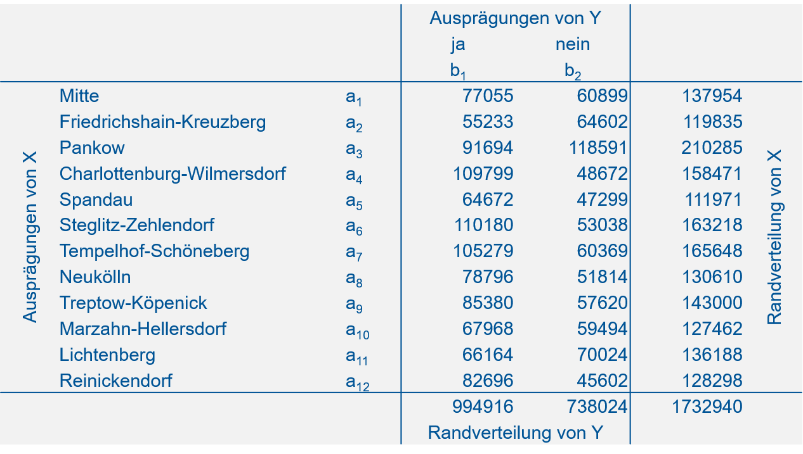
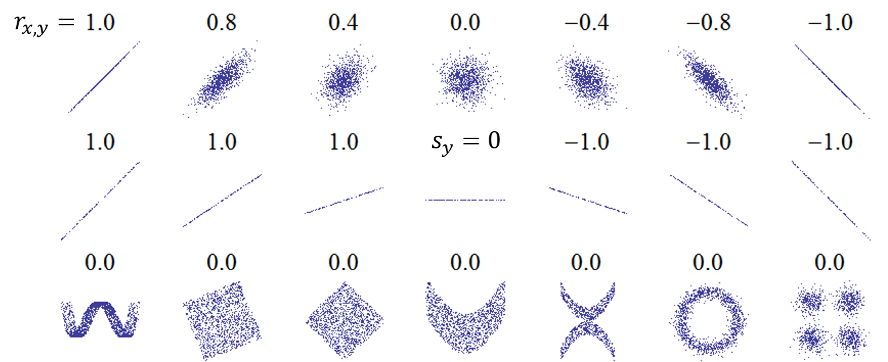

# Korrelationsanalyse {#korrelation}

Lesen Sie hierzu bitte Kapitel 3.4.2 von @zimmermann2014. Die Fragen, die uns besonders interessieren sind:

- Gibt es einen Zusammenhang zwischen zwei Merkmalen?
- Wenn ja, wie kann dieser Zusammenhang charakterisiert werden?
- Wie stark ist der Zusammenhang zwischen den Merkmalen?
- Wie kann man den Zusammenhang visualisieren?

Die Verfahren sind unterschiedlich für nominalskalierte, ordinalskalierte und metrische Merkmale. Wir werden diese jetzt nacheinander einführen. Die Themen können Sie in @mittag2016, Kapitel 8 und 9 vertiefen.

## Nominalskalierte Merkmale: Kontingenztabelle und Chi-Quadrat Statistik

Wir wollen diese Methode am Beispiel des Volksentscheids Tegel von 2017 verdeutlichen.^[Die Daten sind https://www.wahlen-berlin.de/wahlen/BU2017/afspraes/ve/index.html entnommen.] Der Beschlussentwurf lautete:

> "Der Flughafen Berlin-Tegel „Otto-Lilienthal“ ergänzt und entlastet den geplanten Flughafen Berlin Brandenburg „Willy Brandt“ (BER). Der Berliner Senat wird aufgefordert, sofort die Schließungsabsichten aufzugeben und alle Maßnahmen einzuleiten, die erforderlich sind, um den unbefristeten Fortbetrieb des Flughafens Tegel als Verkehrsflughafen zu sichern!"

Wir stellen uns die Frage: Gibt es einen Zusammenhang zwischen Abstimmungsverhalten und Bezirk? Man könnte meinen, dass Anwohner\*innen in der Einflugschneise von Tegel eher für "nein" stimmten (d.h. für die Schließung), Anwohner\*innen in der Einflugschneise des neuen BER dagegen eher für "ja" (d.h. gegen die Schließung). Überlegungen wie diese motivieren unsere Fragestellung.

Die **Kontingenztabelle** (oder Kreuztabelle) zu diesem Beispiel finden Sie in Abbildung \@ref(fig:tegelh).

```{r tegelh, echo=FALSE, fig.align='center', fig.cap='Kongtingenztabelle zum Abstimmungsverhalten im Volksentscheid Tegel 2017 nach Bezirk. Quelle: https://www.wahlen-berlin.de/wahlen/BU2017/afspraes/ve/index.html.', out.width='80%'}

```
In dieser Tabelle stehen absolute Häufigkeiten (vgl. Kapitel \@ref(haeufigkeit)) für alle Kombinationen von Merkmalsausprägungen der Variablen $X$ und $Y$. $X$ bezeichnet "Bezirk" mit den Ausprägungen $a_1, a_2, \ldots, a_n$. $Y$ bezeichnet "Abstimmungsverhalten" mit den Ausprägungen $b_1$ ("ja") und $b_2$ ("nein"). Die Spalten- bzw. Zeilensummen sind die sogenannten Randverteilungen von $Y$ und $X$. Ganz unten rechts steht der Stichprobenumfang (die Anzahl der Personen, die abgestimmt haben). Der Stichprobenumfang kann sowohl als Summe der Randverteilungswerte von $X$, als auch als Summe der Randverteilungswerte von $Y$ errechnet werden. Die Notation der absoluten Häufigkeiten finden Sie in Abbildung \@ref(fig:cth).

```{r cth, echo=FALSE, fig.align='center', fig.cap='Notation der absoluten Häufigkeiten in einer Kongtingenztabelle. Nach: @mittag2016.', out.width='80%'}
knitr::include_graphics('figs/ct_h.png')
```
In dieser Notation stehen $h_{\cdot j}$ und $h_{i \cdot}$ für die Werte der beiden Randverteilungen.

Wir können die Kontingenztabelle auch mit relativen Häufigkeiten darstellen (Abbildung \@ref(fig:tegelf)).

```{r tegelf, echo=FALSE, fig.align='center', fig.cap='Kongtingenztabelle zum Abstimmungsverhalten im Volksentscheid Tegel mit relativen Häufigkeiten.', out.width='80%'}
knitr::include_graphics('figs/tegel_f.png')
```

Als nächstes müssen wir den Begriff der **bedingten relativen Häufigkeit** einführen. Die bedingte relative Häufigkeit ist die Häufigkeit einer Ausprägung des einen Merkmals relativ zur Häufigkeit einer bestimmten Ausprägung des zweiten Merkmals, d.h. "bedingt" dadurch, dass wir uns auf eine Ausprägung des zweiten Merkmals festlegen. Relative Häufigkeiten existieren somit in zwei "Richtungen" in einer Kontingenztabelle (Abbildung \@ref(fig:ctf)).

```{r ctf, echo=FALSE, fig.align='center', fig.cap='Illustration relativer Häufigkeiten in einer Kontingenztabelle. Links: Absolute Häufigkeiten der Ausprägungen von $X$ unter der Bedingung $Y=b_j$. Rechts: Absolute Häufigkeiten der Ausprägungen von $Y$ unter der Bedingung $X=a_i$. Nach: @mittag2016.', fig.show='hold', out.width='50%'}
knitr::include_graphics(c('figs/ct_fy.png','figs/ct_fx.png'))
```

Die Formeln dazu sind:

$$f_Y\left(b_j|a_i\right)=\frac{h_{ij}}{h_{i\cdot}}\quad \text{mit}\quad j=1, 2, \ldots, m$$
$f_Y\left(b_j|a_i\right)$ steht für die relative Häufigkeit einer Merkmalsausprägung $b_j$ von $Y$, bedingt durch eine bestimme Ausprägung $a_i$ von $X$. Die Bedingtheit wird mit dem Zeichen $|$ ausgedrückt.

$$f_X\left(a_i|b_j\right)=\frac{h_{ij}}{h_{\cdot j}}\quad \text{mit}\quad i=1, 2, \ldots, k$$
$f_X\left(a_i|b_j\right)$ steht für die relative Häufigkeit einer Merkmalsausprägung $a_i$ von $X$, bedingt durch eine bestimme Ausprägung $b_j$ von $Y$.

Zum Beispiel: Die relative Häufigkeit von "ja" unter der Bedingung "Charlottenburg-Wilmersdorf" ist (vgl. \@ref(fig:tegelh)):
$$f_Y\left(b_1|a_4\right)=\frac{h_{41}}{h_{4\cdot}}=\frac{109799}{158471}=0.69$$
D.h. 69% der Stimmen in Charlottenburg-Wilmersdorf waren "ja" Stimmen.

Die relative Häufigkeit von "Charlottenburg-Wilmersdorf" unter der Bedingung "ja" dagegen ist:
$$f_X\left(a_4|b_1\right)=\frac{h_{41}}{h_{\cdot 1}}=\frac{109799}{994916}=0.11$$
D.h. 11% der "ja" Stimmen kamen aus Charlottenburg-Wilmersdorf.

Was hat das alles mit dem Zusammenhang zwischen Abstimmungsverhalten und Bezirk zu tun? - Die bedingten relativen Häufigkeiten helfen uns, etwas über die Abhängigkeit bzw. Unabhängigkeit der beiden Merkmale zu sagen. Das läuft über das Konzept der **empirischen Unabhängigkeit**:

Intuitiv werden wir **Unabhängigkeit** von $X$ und $Y$ als gegeben ansehen, wenn die Ausprägung eines Merkmals keinen Einfluss auf die Ausprägung des anderen Merkmals hat.
Dies bedeutet, dass eine bedingte Häufigkeitsverteilung für ein Merkmal nicht davon abhängt, welche Merkmalsausprägung für das andere Merkmal als Bedingung vorausgesetzt wird. D.h. der Anteil von Charlottenburg-Wilmersdorf an den "ja" Stimmen sollte etwa so groß sein wie der Anteil von Charlottenburg-Wilmersdorf an den "nein" Stimmen. Bzw. der Anteil der "ja" Stimmen in Charlottenburg-Wilmersdorf sollte etwa so groß sein wie der Anteil der "ja" Stimmen in jedem anderen Bezirk.

In Formeln ausgedrückt heißt das:
$$f_X\left(a_i|b_1\right)=f_X\left(a_i|b_2\right)=\cdots=f_X\left(a_i|b_m\right)$$

Bzw.:
$$\frac{h_{i1}}{h_{\cdot 1}}=\frac{h_{i2}}{h_{\cdot 2}}=\cdots=\frac{h_{im}}{h_{\cdot m}}=\frac{h_{i\cdot}}{n}$$

Allgemein formuliert:
$$\frac{h_{ij}}{h_{\cdot j}}=\frac{h_{i\cdot}}{n}$$

Umstellen dieser Gleichung nach $h_{ij}$ ergibt:
$$h_{ij}=\frac{h_{i\cdot}\cdot h_{\cdot j}}{n}:=\tilde h_{ij}$$
Diese absolute Häufigkeit, die wir mit $\tilde h_{ij}$ bezeichnen, ist die _bei empirischer Unabhängigkeit erwartete_ absolute Häufigkeit. Das Zeichen $:=$ bedeutet "wird definiert als". Wir haben uns also mit Hilfe der relativen Häufigkeiten in der Kontingenztabelle und unserer Konzeption der empirischen Unabhängigkeit neue, bei Unabhängigkeit erwartete absolute Häufigkeiten an jeder Stelle der Kontingenztabelle generiert. Diese können wir jetzt mit den tatsächlichen absoluten Häufigkeiten in der Kontingenztabelle vergleichen (Abbildung \@ref(fig:ctvergleich)). Sind die Abweichungen klein können wir von Unabhängigkeit der Merkmale ausgehen. Sind die Abweichungen groß können wir von Abhängigkeit ausgehen.

```{r ctvergleich, echo=FALSE, fig.align='center', fig.cap='Vergleich der beobachteten absoluten Häufigkeiten $h_{ij}$ und der bei empirischer Unabhängigkeit erwarteten absoluten Häufigkeiten $\\tilde h_{ij}$.', out.width='80%'}
knitr::include_graphics('figs/ct_vergleich.png')
```

Als Vergleichsmaß wird die sogenannte **Chi-Quadrat Statistik** $\mathcal{X}^2$ (oder quadratische Kontingenz) verwendet, und das ist dann auch unser **Zusammenhangsmaß für nominalskalierte Merkmale**. $\mathcal{X}^2$ ergibt sich aus der Differenz der tatsächlichen Häufigkeiten $h_{ij}$ und den erwarteten Häufigkeiten bei empirischer Unabhängigkeit $\tilde h_{ij}$:
$$\mathcal{X}^2=\sum_{i=1}^{k}\sum_{j=1}^{m}\frac{\left(h_{ij}-\tilde h_{ij}\right)^2}{\tilde h_{ij}}$$

Bei Unabhängigkeit der Merkmale ist $\mathcal{X}^2=0$. Bei vollständiger Abhängigkeit ist $\mathcal{X}^2=\mathcal{X}_{max}^2$, wobei $\mathcal{X}_{max}^2=n\cdot(M-1)$ mit $M=\min(k;m)$. D.h. der maximal mögliche Wert der $\mathcal{X}^2$ Statistik eribt sich durch die Dimensionen der Kontingenztabelle, die Zeilenanzahl $k$ und die Spaltenanzahl $m$. Dadurch können wir leider die Größenordnung der $\mathcal{X}^2$ Statistik schlecht intuitiv einordnen, was unser Beispiel verdeutlicht:

Für den Volksentscheid Tegel ergibt sich ein Wert von $\mathcal{X}^2=49895.1$, wobei $\mathcal{X}_{max}^2=1732940$. Da $\mathcal{X}^2$ näher an 0 ist als an 1 732 940, scheint die Abhängigkeit der Merkmale "Bezirk" und "Abstimmungsverhalten" gering zu sein. Ob sie dennoch _statistisch signifikant_ ist können wir erst mit einem sogenannten **Chi-Quadrat-Test** beurteilen, den wir als Teil der schließenden Statistik in Kapitel \@ref(chi2testkstest) kennenlernen.

## Ordinalskalierte Merkmale: Rangkorrelationskoeffizient nach Spearman

Hier ist das Beispiel des Zusammenhangs von Grünflächenanteil und Bildungsgrad in Stadbezirken in @zimmermann2014, Kapitel 3.4.2, S. 274-278 sehr anschaulich. Das Merkmal "Grünflächenanteil" ist zwar metrisch skaliert, muss ab ordinal skaliert werden, um es mit dem Merkmal "Bildungsgrad" vergleichbar zu machen, das ordinal vorliegt. S. Tabelle 3.36 in @zimmermann2014, S. 277.

Der **Rangkorrelationskoeffizient nach Spearman** $r_s$ für $n$ Wertepaare $\left(x_i,y_i\right)$ mit $i=1, 2, \ldots, n$ wird dann berechnet durch:
$$r_s=1-\frac{6\cdot\sum_{i=1}^{n}d_i^2}{n\cdot\left(n^2-1\right)}$$
Wobei $d_i$ die Differenz der Ränge der beiden Merkmale $X$ und $Y$ ist.

Bei perfekter negativer Rangkorrelation ist $r_s=-1$. Bei perfekter positiver Rangkorrelation ist $r_s=1$. Wenn eine Rangkorrelation vorliegt ist $r_s=0$.

Bei dem Grünflächenanteil/Bildungsgrad Beispiel von @zimmermann2014 ist $r_s=0.84$, die beiden Merkmale sind also stark positiv korreliert. D.h. größere Anteile von Grünflächen sind tendenziell mit höheren Bildungsgraden assoziiert und kleinere Anteile von Grünflächen sind tendenziell mit geringeren Bildungsgraden assoziiert.

## Metrische Merkmale: Scatterplot (Streudiagramm) und Korrelationskoeffizient nach Bravais-Pearson

An dieser Stelle können wir zu unseren Reisedaten zurückkehren. Beide Merkmale ("Entfernung" und "Reisezeit") sind metrisch skaliert und somit können wir den Korrelationskoeffizienten nach Bravais-Pearson verwenden, der mehr Informationen über den Zusammenhang, nämlich **Linearität**, liefert. Einen ersten Eindruck verschafft der **Scatterplots** (oder Streudiagramms), den wir einfach mit der `plot()` Funktion in R generieren:
```{r include=FALSE}
# Paket laden, das für das Einlesen von xlsx gebraucht wird
library("readxl")
# Daten einlesen
reisedat <- read_excel("data/Reisedaten.xlsx", na = "-999")
# in data.frame umwandeln
reisedat <- as.data.frame(reisedat)
# Spalten umbenennen
names(reisedat) <- c('x','t')
```
```{r echo=TRUE}
plot(reisedat$x/1000, reisedat$t, xlab="Entfernung (km)", ylab="Reisezeit (min)")
```

**Aufgabe:** _Überlegen Sie kurz, wie stark die Korrelation hier sein wird. (Auflösung weiter unten.)_

Die _lineare_ Korrelation zweier metrischer Merkmale wird üblicherweise mit dem Produkt-Moment-**Korrelationskoeffizient** nach Bravais-Pearson $r_{x,y}$ für $n$ Wertepaare $\left(x_i,y_i\right)$ mit $i=1, 2, \ldots, n$ berechnet. Er ergibt sich aus den Standardabweichungen $s_x$ und $s_y$ und der standardisierten Kovarianz $s_{x,y}$ durch:
$$r_{x,y}=\frac{s_{x,y}}{s_x\cdot s_y}=\frac{\frac{1}{n-1}\cdot\sum_{i=1}^{n}\left(x_i-\bar x\right)\cdot\left(y_i-\bar y\right)}{\sqrt{\frac{1}{n-1}\cdot\sum_{i=1}^{n}\left(x_i-\bar x\right)^2}\cdot\sqrt{\frac{1}{n-1}\cdot\sum_{i=1}^{n}\left(y_i-\bar y\right)^2}}$$

In R mit der `cor()` Funktion:
```{r echo=TRUE}
cor(reisedat$x, reisedat$t, use="complete.obs", method="pearson")
```
Das Argument `use="complete.obs"` teilt R mit, nur vollständige Datenpaare zu verwenden, d.h. ohne "NA", ansonsten wäre der Output "NA". Anstatt `method="pearson"` sind ebenfalls `method="spearman"` und `method="kendall"` möglich; beides sind Rangkorrelationskoeffizienten.

In Abbildung \@ref(fig:pearson) sehen Sie Werte des Korrelationskoeffizienten für verschiedene Zusammenhänge. Bei augenscheinlich nicht-linearen Zusammenhängen wählt man üblicherweise einen Rangkorrelationskoeffizienten, der dann aussagekräftiger ist.

```{r pearson, echo=FALSE, fig.align='center', fig.cap='Werte des Korrelationskoeffizienten für verschiedene Zusammenhänge. Quelle: https://upload.wikimedia.org/wikipedia/commons/thumb/0/02/Correlation_examples.png/440px-Correlation_examples.png.', out.width='80%'}

```
