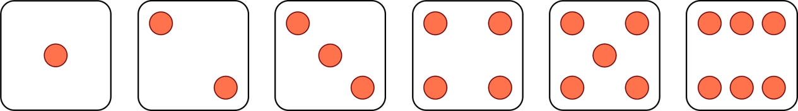
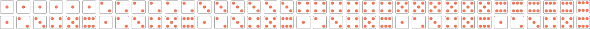
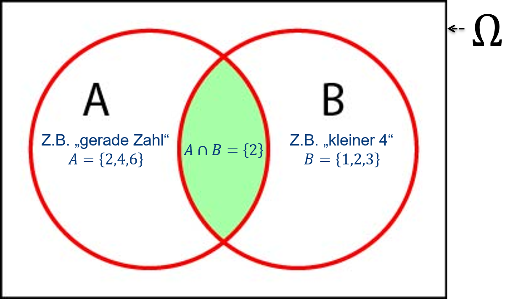
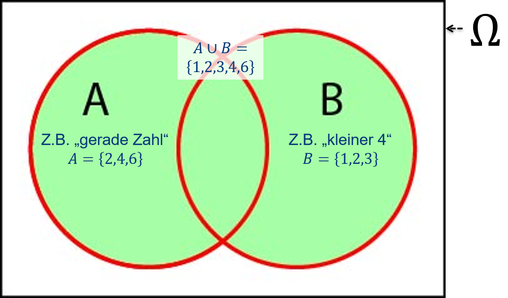
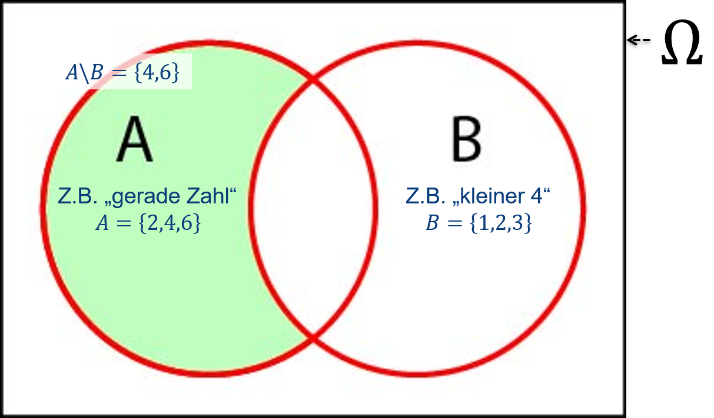
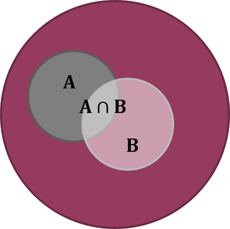

# (PART\*) Wahrscheinlichkeitstheorie {-}

# Grundlagen der Wahrscheinlichkeitsrechnung {#wahrscheinlichkeit}

Die Wahrscheinlichkeitstheorie bildet die Brücke zwischen der deskriptiven und der induktiven Statistik, um bei dem Bild von @zimmermann2014 zu bleiben. Sie liefert Modelle in der Form von Wahrscheinlichkeitsverteilungen (s. Kapitel \@ref(verteilungen)), die es uns erlauben von Stichproben auf Grundgesamtheiten zu schließen.

Dieses Kapitel motiviert zunächst **Zufallsvorgänge** und definiert ein paar grundlegende Begriffe. Sodann werden **Ereignisse** als Ergebnis eines Zufallsvorgangs über die Mengenleere eingeführt.^[Eine alternative Herleitung der Wahrscheinlichkeitstheorie ginge über Aussagenlogik. Diese sehen wir uns beispielsweise in meinem Masterkurs _Risk and Uncertainty in Science and Policy_ an.]. Dazu gehört die Darstellung des **Venn-Diagramms**. Sodann werden **Zufallsvariablen** und **Zufallsexperimente** definiert, bevor wir zum Begriff der **Wahrscheinlichkeit** kommen. Dabei schauen wir uns besonders Konzepte wie **bedingte Wahrscheinlichkeit** und **Unabhängigkeit von Ereignissen**, sowie die Rechenregeln der Wahrscheinlichkeitsrechnung an.

## Zufallsvorgänge

Wir alle kennen Zufallsvorgänge im Alltagsleben; z.B. Glücksspiele wie Roulette, Würfelspiele und die Ziehung der Lottozahlen. Aber auch Prozesse wie die Entwicklung von Börsenkursen, die Abschätzung von Schadensverläufen oder Lebenserwartungen (wichtig für Versicherungen) und Marktrisiken (wichtig für Unternehmen) werden als Zufallsvorgänge konzeptionalisiert und behandelt. Das sind Prozesse, die auf der Maßstabsebene, auf der wir sie betrachten gewisse Regularitäten aufweisen, die Glücksspielen ähneln und deshalb als Zufallsvorgänge betrachtet werden können. Das mag aber nur deshalb so sein weil wir die zugrunde liegenden Kausalketten nicht kennen oder nicht beschreiben können bzw. das zu aufwendig wäre. Das gleiche trifft übrigens auch auf Glücksspiele zu, deren Verlauf wir theoretisch auch physikalisch beschreiben könnten wenn wir nur alle Randbedingungen bestimmen könnten. Aus diesem Blickwinkel sind Zufallsvorgänge also immer nur grobskalige _Modelle_ für Prozesse, die auf kleineren Skalen ablaufen und die wir nicht vollständig quantifizieren (können). Ob es am Ende einer Kausalkette unteilbare, "echte" Zufallsvorgänge gibt wird beispielsweise in der Physik debatiert.

Die Wahrscheinlichkeitsrechnung stellt jedenfalls Modelle bereit, die es erlauben, den Verlauf zufallsabhängiger Prozesse abzuschätzen und _von Stichproben auf Grundgesamtheiten zu schließen_. Die bisher thematisierte beschreibende Statistik charakterisiert gegebene Datensätze ohne einen Rückschluss auf Eigenschaften umfassenderer Grundgesamtheiten zu vermitteln.

Formal gesehen konzeptionalisieren wir Zufallsvorgänge wie folgt. Nehmen wir z.B. einen Würfelwurf. Der _Wurf mit einem Würfel_ hat die sogenannte **Ergebnismenge** $\Omega=\{1,2,3,4,5,6\}$ aller möglicher sogenannter **Elementarereignisse** $\omega=1,2,\ldots,6$ (Abbildung \@ref(fig:wuerfel1)). Als **Ereignis** bezeichnen wir eine Teilmenge der Ergebnismenge; z.B. das Ereignis "gerade Zahl" $A=\{2,4,6\}$.
```{r wuerfel1, echo=FALSE, fig.align='center', fig.cap='Ergebnismenge $\\Omega=\\{1,2,3,4,5,6\\}$ eines Würfelwurfes.', out.width='50%'}

```

Nehmen wir nun das Beispiel eines _Wurfes mit zwei Würfeln_. Hier ist die **Ergebnismenge** $\Omega=\{(1;1),(1;2),\ldots,(6;6)\}$ (Abbildung \@ref(fig:wuerfel2)). Ein **Ereignis** ist z.B. "Gesamtaugenzahl 7" $A=\{(1;6),(2;5),(3;4),(4;3),(5;2),(6;1)\}$.
```{r wuerfel2, echo=FALSE, fig.align='center', fig.cap='Ergebnismenge $\\Omega=\\{(1;1),(1;2),\\ldots,(6;6)\\}$ eines Wurfes mit zwei Würfeln.', out.width='100%'}

```

Ein **Zufallsvorgang** ist formal definiert als ein Prozess, der zu einem von mehreren, sich gegenseitig ausschließenden Ergebnissen $\omega$ führt. Welches Ergebnis eintritt, ist vorab nicht bekannt.
Mögliche Ergebnisse $\omega$ heissen **Elementarereignisse** und die **Ergebnismenge** $\Omega$ ist definert als $\Omega=\{x : x \text{ ist Elementarereignis}\}$. $\Omega$ kann endlich oder auch unendlich viele Elemente enthalten. Ein Beisiel für eine **unendliche Ergebnismenge** ist wie oft man Lotto spielen muss bis man "Sechs Richtige und Zusatzzahl" hat; $\Omega=\{1,2,\ldots,\infty\}=\mathbb{N}$, wobei $\mathbb{N}$ die Menge der natürlichen Zahlen ist. Eine Teilmenge $A$ von $\Omega$ heißt **Ereignis**.

## Ereignisse

Das sogenannte **sichere Ereignis** ist $A=\Omega$; z.B. bei einem Würfelwurf $A=\Omega=\{1,2,3,4,5,6\}$. Das sogenannte **unmögliche Ereignis** ist $A=\bar\Omega=\emptyset$, wobei $\bar\Omega$ das Komplementärereignis ("nicht $\Omega$") und $\emptyset$ die leere Menge ist.

Das **Komplementärereignis** lässt sich mit einem sogenannten Venn-Diagramm veranschaulichen (Abbildung \@ref(fig:komplementaer)). Das **Venn-Diagramm** kommt aus der Mengenleere und symbolsiert verschiedene Arten von Mengen (hier Ereignisse) als Flächen, deren Größe idealerweise proportional zur Größe der Menge ist, was aber in unseren Darstellungen nicht der Fall ist.
```{r komplementaer, echo=FALSE, fig.align='center', fig.cap='Venn-Diagramm des Komplementärereignisses $\\bar A$. Wenn das Rechteck die Ergebnismenge $\\Omega$ ist dann sind alle Elementarereignisse, die nicht im Ereignis $A$ (weiß) sind im Komplementärereignis $\\bar A$ (grün).<br><small>Nach: @mittag2016.</small>', out.width='60%'}
knitr::include_graphics('figs/Komplementaerereignis.png')
```

Die **Schnittmenge zweier Ereignisse** $A$ und $B$ wird mit $A\cap B$ symbolisiert; die Ereignisse $A$ _und_ $B$ treten beide ein (Abbildung \@ref(fig:schnitt)).
```{r schnitt, echo=FALSE, fig.align='center', fig.cap='Venn-Diagramm der Schnittmenge zweier Ereignisse $A\\cap B$. Die grüne Fläche beschreibt die Schnittmenge, d.h. das Ereignis, dass $A$ _und_ $B$ beide eintreten.<br><small>Nach: @mittag2016.</small>', out.width='60%'}

```

Die **Vereinigungsmenge zweier Ereignisse** $A$ und $B$ wird mit $A\cup B$ symbolisiert; das Ereignis $A$ _oder_ das Ereignis $B$ tritt ein (Abbildung \@ref(fig:vereinigung)).
```{r vereinigung, echo=FALSE, fig.align='center', fig.cap='Venn-Diagramm der Vereinigungsmenge zweier Ereignisse $A\\cup B$. Die grüne Fläche beschreibt die Vereinigungsmenge, d.h. das Ereignis, dass $A$ _oder_ $B$ eintritt.<br><small>Nach: @mittag2016.</small>', out.width='60%'}

```

Die **Differenzmenge zweier Ereignisse** $A$ und $B$ schließlich ist die Schnittmenge von $A$ und $\bar B$ (Komplementärereignis von $B$) und wird mit $A\setminus B=A\cap\bar B$ symbolisiert (Abbildung \@ref(fig:differenz)).
```{r differenz, echo=FALSE, fig.align='center', fig.cap='Venn-Diagramm der Differenzmenge zweier Ereignisse $A\\setminus B=A\\cap\\bar B$. Die grüne Fläche beschreibt die Schnittmenge von $A$ und $\\bar B$.<br><small>Nach: @mittag2016.</small>', out.width='60%'}

```

## Zufallsvariablen

Interpretiert man die Werte eines Merkmals als Ergebnis eines Zufallsvorgangs, dann nennt man das Merkmal **Zufallsvariable** und die möglichen Ergebnisse des Zufallsprozesses **Ausprägungen** oder **Realisierungen** der betreffenden Zufallsvariable (vgl. deskriptive Statistik). Wir unterscheiden diskrete und stetige Zufallsvariablen. Bei einer **diskreten Zufallsvariable** ist die Anzahl der Ausprägungen _abzählbar_; z.B. Anzahl der Richtigen beim Lotto. Bei einer **stetigen Zufallsvariable** (auch kontinuierlich genannt) ist die Anzahl der Ausprägungen theoretisch _nicht abzählbar_; z.B. Entfernung zwischen Wohnort und Arbeitsplatz einer zufällig aus einer größeren Menschengruppe ausgewählten Person. Praktisch wird es aber immer eine Messungenauigkeit geben - wir können Entfernung nicht mit beliebig vielen Nachkommastellen messen. D.h. auch hier ist die Stetigkeit von Zufallsvariablen ein mathematisches Modell für das, was wir in der Welt sehen.

In der Wissenschaft sprechen wir oft von Zufallsexperimenten, wobei wir kontrollierte und nicht-kontrollierte Zufallsexperimente unterscheiden. Ein **kontrolliertes Zufallsexperiment** ist unter annähernd gleichbleibenden Bedingungen wiederholbar; z.B. Ziehung der Lottozahlen. Ein **nicht-kontrolliertes Zufallsexperiment** ist z.B. die Durchschnittstemperatur im Monat Juli an einem bestimmten Ort. Diese hängt von Faktoren ab, die wir nicht experimentell kontrollieren können.

## Wahrscheinlichkeit

So wie wir Zufallsvorgänge und Ereignisse aus der Mengenleere kommend konzeptionalisiert haben^[Zufallsvorgänge und Ereignisse aus der Mengenleere kommend zu konzeptionalisiert ist der klassische Ansatz. Alternative Herangehensweisen können Sie im Masterstudium kennenlernen.] ist die **Wahrscheinlichkeit** für das Eintreten eines Ereignisses $A$ - $\Pr(A)$ - als _Grenzwert der relativen Häufigkeit_ des Eintretens von $A$ definiert:^[Streng genommen gilt der Grenzwert der relativen Häufigkeit als Wahrscheinlichkeit nur unter Voraussetzung der beliebigen Wiederholbarkeit eines Zufallsexperiments unter konstanten Bedingungen.]
$$\begin{equation}
f_n(A)\xrightarrow{n\to\infty}\Pr(A)
(\#eq:wahrscheinlichkeit)
\end{equation}$$

Veranschaulichen wir das mit dem Beispiel Münzwurf (Abbildung \@ref(fig:muenze)): Mit zunehmender Anzahl Münzwürfe $n$ nähert sich die relative Häufigkeit $f_n$ des Ereignisses "Zahl" (ebenso "Kopf") dem erwarteten Wert 0.5 an. Wenn $n$ (hypothetisch) gegen unendlich geht ($n\to\infty$) dann nennen wir diesen Grenzwert Wahrscheinlichkeit.
```{r muenze, echo=TRUE, fig.align='center', fig.cap='Simulation von 1000 Münzwürfen und die Entwicklung der relativen Häufigkeit von "Zahl". Wir sehen, dass sich die relative Häufigkeit mit zunehmender Anzahl Münzwürfe dem erwarteten Wert 0.5 annähert. Den Grenzwert der relativen Häufigkeit wenn die Anzahl der Münzwürfe gegen unendlich geht nennen wir Wahrscheinlichkeit.', out.width='80%'}
# simuliere 1000 Münzwürfe
# dies geschieht hier mit einem Bernoulliprozess,
# wobei die Wahrscheinlichkeit für Erfolg (in unserem Fall "Zahl") gleich 0.5 ist
# der Bernoulliprozess ist der Spezialfall eines Binomialprozesses mit einem Versuch,
# daher der R-Befehl
# im Output steht 1 für "Zahl" und 0 für "Kopf"
zahl <- rbinom(1000,1,0.5)
# berechne relative Häufigkeit für "Zahl" nach jedem Münzwurf
# das ist die Summe der bisherigen Ereignisse "Zahl",
# geteilt durch die jeweilige Anzahl der Münzwürfe
f = cumsum(zahl) / seq(1,1000,1)
# plot
plot(seq(1,1000,1), f, type = 'n',
     xlim = c(0,1000), ylim = c(0,1),
     xlab = 'Anzahl Münzwürfe n', ylab = 'Relative Häufigkeit f_n(Zahl)')
abline(h = 0.5, lwd = 3, col = "red")
points(seq(1,1000,1), f, pch = 20)
text(800, 0.6, 'Grenzwert: Pr(Zahl)=0.5')
```

## Axiome der Wahrscheinlichkeitstheorie nach Kolmogorow

Die Wahrscheinlichkeitstheorie beruht wie jede Theorie auf gewissen sogenannten Axiomen, d.h. Annahmen, die so grundlegend sind, dass sie in der Anwendung nicht in Frage gestellt werden. Ohne Axiome gibt es keine Wahrscheinlichkeitstheorie. Die Herleitung der Wahrscheinlichkeitstheorie aus der Mengenlehre formuliert die Axiome nach Kolmogorow:

$$K1: \Pr(A)\geq0$$
Das ist die **Nicht-Negativitätsbedingung**, die besagt, dass die Wahrscheinlichkeit eines Ereignisses $A$ immer größer oder gleich 0 ist.

$$K2: \Pr(\Omega)=1$$
Das ist die **Normierung**, die besagt, dass die Wahrscheinlichkeit der Ergebnismenge $\Omega$ immer 1 ist, das sichere Ereignis.

$$K3: \Pr(A\cup B)=\Pr(A)+\Pr(B)\quad\text{falls}\quad A\cap B=\emptyset$$
Das ist die **Additivität bei Ereignissen, die keine Schnittmenge haben**, die besagt, dass, falls $A$ und $B$ keine Schnittmenge haben, die Wahrscheinlichkeit, dass $A$ _oder_ $B$ eintritt die Summe der Wahrscheinlichkeiten von $A$ und $B$ ist.

Axiom K3 machen wir uns am besten wieder anhand eines Venn-Diagramms klar (Abbildung \@ref(fig:k3)): Nehmen wir zwei Ereignisse eines Würfelwurfes $A=\{1,2\}$ ("1 oder 2") und $B=\{3,4\}$ ("3 oder 4"), die keine Schnittmenge haben, d.h. $A\cap B=\emptyset$. Dann ist die Wahrscheinlichkeit des Ereignisses $A\cup B=\{1,2,3,4\}$ ("1 oder 2 oder 3 oder 4") die Summe der Einzelwahrscheinlichkeiten von $A$ und $B$; $\Pr(A\cup B)=\Pr(A)+\Pr(B)=\frac{1}{3}+\frac{1}{3}=\frac{2}{3}$.
```{r k3, echo=FALSE, fig.align='center', fig.cap='Venn-Diagramm zweier Ereignisse eines Würfelwurfes $A=\\{1,2\\}$ und $B=\\{3,4\\}$, die keine Schnittmenge haben $\\left(A\\cap B=\\emptyset\\right)$. Die Wahrscheinlichkeit des Ereignisses $A$ _oder_ $B$ $\\left(A\\cup B=\\{1,2,3,4\\}\\right)$ ist die Summe der Einzelwahrscheinlichkeiten von $A$ und $B$.', out.width='80%'}
knitr::include_graphics('figs/Kolmogorow3.png')
```

## Rechenregeln

Aus den o.g. Axiomen lassen sich die Rechenregeln der Wahrscheinlichkeitsrechnung ableiten. Es mag phantastisch klingen, aber man braucht tatsächlich keine weiteren Annahmen als die Axiome, um zu relativ komplizierten Regeln zu kommen.

Als erstes steht die **Produktregel**:
$$\begin{equation}
\Pr(A\cap B)=\Pr(A|B)\cdot\Pr(B)=\Pr(B|A)\cdot\Pr(A)
(\#eq:produktregel)
\end{equation}$$
In Worten: Die Wahrscheinlichkeit, dass $A$ und $B$ beide eintreten errechnet sich aus der bedingten Wahrscheinlichkeit von $A$ gegeben $B$ mal der Wahrscheinlichkeit von $B$, oder umgekehrt. Neu hier ist der Begriff der **bedingten Wahrscheinlichkeit**, für die das Symbol "|" verwendet wird: $\Pr(A|B)$ ist die Wahrscheinlichkeit von $A$ falls $B$ ebenfalls eingetreten ist ("$A$ gegeben $B$"). Das ist nicht zu verwechseln mit der Wahrscheinlichkeit $\Pr(A\cap B)$, dass $A$ _und_ $B$ beide eintreten (dafür ist die Produktregel da); bei der bedingten Wahrscheinlichkeit geht es nur um die Wahrscheinlichkeit eines Ereignisses (hier $A$), jedoch _bedingt_ durch ein anderes Ereignis (hier $B$). Die Reihenfolge von $A$ und $B$ macht hier keinen Unterschied, d.h. $\Pr(A|B)\cdot\Pr(B)=\Pr(B|A)\cdot\Pr(A)$.

Machen wir uns die Produktregel mit einem sogenannten **Baumdiagramm** zweier Würfelwürfe klar (Abbildung \@ref(fig:produktregel)): Die Wahrscheinlichkeit im ersten Wurf eine 1 zu würfeln ist $\Pr(A=1)=\frac{1}{6}$. Die Wahrscheinlichkeit im zweiten Wurf ebenfalls eine 1 zu würfeln, d.h. wenn man bereits eine gewürfelt hat, ist die bedingte Wahrscheinlichkeit $\Pr(B=1|A=1)=\frac{1}{6}$. Die Wahrscheinlichkeit zwei Einsen zu würfeln ist laut Produktregel $\Pr(A=1\cap B=1)=\Pr(B=1|A=1)\cdot\Pr(A=1)=\frac{1}{6}\cdot\frac{1}{6}=\frac{1}{36}$, was ebenfalls intuitiv Sinn macht. Auch wenn das Baumdiagramm eine Reihenfolge suggeriert, gilt die Rechnung nicht nur für sequenzielle sondern auch für gleichzeitige Würfelwürfe. Ebenfalls können $A$ und $B$ vertauscht werden, da laut Produktregel $\Pr(A|B)\cdot\Pr(B)=\Pr(B|A)\cdot\Pr(A)$.
```{r produktregel, echo=FALSE, fig.align='center', fig.cap='Baumdiagramm zweier Würfelwürfe. Der erste Würfelwurf ist das Ereignis $A$ mit sechs Ausprägungen $1,2,\\ldots,6$. Für jede dieser Ausprägungen gibt es wieder sechs Ausprägungen $1,2,\\ldots,6$ des Ereignisses $B$, des zweiten Würfelwurfs. Jeder der Pfade, die sich so ergeben führt zu einer Ausprägung des Ereignisses $A\\cap B$, $A$ _und_ $B$. Die Gesamtzahl dieser Ausprägungen ist $6\\cdot 6=36$. Die Wahrscheinlichkeit von $A$ ist $\\Pr(A)$, die Wahrscheinlichkeit von $B$ ist aber $\\Pr(B|A)$, die Wahrscheinlichkeit von $B$ unter der Bedingung, dass $A$ ebenfalls eingetreten ist. Das können sequenzielle als auch gleichzeitige Würfelwürfe sein, und auch die Reihenfolge ist egal, da laut Produktregel $\\Pr(A|B)\\cdot\\Pr(B)=\\Pr(B|A)\\cdot\\Pr(A)$.', out.width='80%'}
knitr::include_graphics('figs/Produktregel.png')
```

Jetzt ist es etwas akademisch bei diesem Beispiel von bedingten Wahrscheinlichkeiten zu sprechen, da die bedingte Wahrscheinlichkeit $\Pr(B|A)$ im Fall der Würfelwürfe ja gleich $\Pr(B)$ ist, z.B. $\Pr(B=1|A=1)=\Pr(B=1)=\frac{1}{6}$. Das Ergebnis des Wurfes $A$ hat keinen Auswirkungen auf die Wahrscheinlichkeit von $B$; wir sagen die beiden Ereignisse sind unabhängig. Zwei Ereignisse $A$ und $B$ werden formal als **unabhängig** bezeichnet, wenn das Eintreten eines Ereignisses keinen Einfluss auf das andere Ereignis hat, z.B. $\Pr(A\cap B)=\Pr(B|A)\cdot\Pr(A)=\Pr(B)\cdot\Pr(A)$. Grundsätzlich kann aber ein Ereignis $A$ die Wahrscheinlichkeit eines zweiten Ereignisses $B$ beeinflussen.

Als zweites steht die **Summenregel**:
$$\begin{equation}
\Pr(A)+\Pr(\bar A)=1
(\#eq:summenregel)
\end{equation}$$
In Worten: Die Summe der Wahrscheinlichkeiten, dass $A$ eintritt oder nicht ist 1.

Wichtiger ist die **generalisierte Summenregel**:
$$\begin{equation}
\Pr(A\cup B)=\Pr(A)+\Pr(B)-\Pr(A\cap B)
(\#eq:gensummenregel)
\end{equation}$$
In Worten: Die Wahrscheinlichkeit, dass $A$ oder $B$ eintritt oder beide errechnet sich aus der Summe der Wahrscheinlichkeiten von $A$ und $B$ minus der Wahrscheinlichkeit, dass $A$ und $B$ beide eintreten.

Das können wir uns wiederum mit einem Venn-Diagramm klar machen (Abbildung \@ref(fig:gensummenregel)): Im Venn-Diagramm sind die Flächengrößen proportional zu den Wahrscheinlichkeiten der entsprechenden Ereignisse. Wenn uns die Wahrscheinlichkeit interessiert, dass $A$ oder $B$ eintritt (oder beide)^[Das logische "oder" impliziert, dass beide Ereignisse eintreten.] dann ist das die Summe der beiden Flächen im Venn-Diagramm, d.h. die Summe der Einzelwahrscheinlichkeiten $\Pr(A)$ und $\Pr(B)$. Wenn jetzt aber die beiden Flächen überlappen dann würde man mit der vorgenannten Summe die Schnittmenge doppelt zählen. Deshalb ziehen wir die Schnittmenge, die Wahrscheinlichkeit $\Pr(A\cap B)$, in der generalisierten Summenregel einmal ab, um die reine Vereinigungsmenge, die Wahrscheinlichkeit $\Pr(A\cup B)$, zu erhalten.
```{r gensummenregel, echo=FALSE, fig.align='center', fig.cap='Venn-Diagramm der generalisierten Summenregel, wobei die Flächengrößen proportional zu den Wahrscheinlichkeiten der entsprechenden Ereignisse sind. Die Wahrscheinlichkeit, dass $A$ oder $B$ eintritt (oder beide) ist die Summe der beiden Flächen im Venn-Diagramm, d.h. die Summe der Einzelwahrscheinlichkeiten $\\Pr(A)$ und $\\Pr(B)$, minus der überlappenden Schnittmenge, die Wahrscheinlichkeit $\\Pr(A\\cap B)$, da wir diese sonst doppelt zählen würden.', out.width='30%'}

```

Als dritte und letzte Regel steht die **Additivität**: Für $n$ sich gegenseitig ausschließende Ereignisse $\{A_1,\ldots,A_n\}$, d.h. nur ein Ereignis kann auftreten, gilt:
$$\begin{equation}
\Pr(A_1\cup \cdots \cup A_m)=\sum_{i=1}^{m}\Pr\left(A_i\right)\quad \text{für}\quad 1\leq m\leq n
(\#eq:additivitaet1)
\end{equation}$$

Für $n$ vollständige Ereignisse $\{A_1,\ldots,A_n\}$, d.h. ein Ereignis muss auftreten, gilt:
$$\begin{equation}
\sum_{i=1}^{n}\Pr\left(A_i\right)=1
(\#eq:additivitaet2)
\end{equation}$$

Ein Beispiel liefert wieder das Baumdiagramm zweier Würfelwürfe (Abbildung \@ref(fig:additivitaet)): Die Wahrscheinlichkeit, dass wir im ersten Wurf eine 1 _oder_ eine 2 würfeln ist die Summe der Einzelwahrscheinlichkeiten: $\Pr((A=1)\cup (A=2))=\frac{1}{6}+\frac{1}{6}=\frac{1}{3}$. Die Wahrscheinlichkeit, bei zwei Würfen eine der 36 Ausprägungen zu würfeln ist logischerweise 1: $\sum_{j=1}^{6}\sum_{i=1}^{6}\Pr(B_j\cap A_i)=\frac{1}{36}+\cdots+\frac{1}{36}=1$.
```{r additivitaet, echo=FALSE, fig.align='center', fig.cap='Baumdiagramm zweier Würfelwürfe. Die Wahrscheinlichkeit, dass wir im ersten Wurf eine 1 _oder_ eine 2 würfeln ist die Summe der Einzelwahrscheinlichkeiten. Die Wahrscheinlichkeit, bei zwei Würfen eine der 36 Ausprägungen zu würfeln ist logischerweise 1.', out.width='80%'}

```
