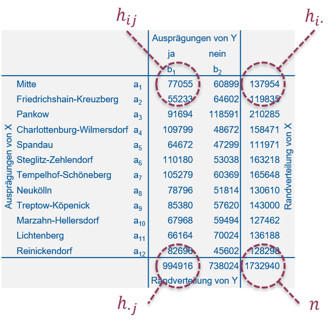

# Statistische Tests {#tests}

Wie wir in Kapitel \@ref(schaetzen) gelernt haben geht es in der schließenden Statistik um die Verdichtung der Informationen in einer Stichprobe in Form von Stichprobenfunktionen, mit denen wir _bestimmte Parameter der Grundgesamtheit schätzen_ (vgl. @mittag2016, Abb. 14.1, S. 212). Während es sich im Fall von Verteilungsparametern bei den Stichprobenfunktionen v.a. um den Mittelwert und die Standardabweichung handelt, sind die Stichprobenfunktionen im Fall von statistischen Tests sogenannte **Teststatistiken**, die die Informationen in der Stichprobe verdichten.

```{r echo=FALSE}
# Paket laden, das für das Einlesen von xlsx gebraucht wird
library(readxl)
library(ggplot2)
# Daten einlesen
reisedat <- read_excel("data/Daten_Distanz_Reisezeit_2024_korrigiert.xlsx", na = "-999")
# in data.frame umwandeln
reisedat <- as.data.frame(reisedat)
```

Wir werden das vorliegende Kapitel über die nächsten drei Wochen lesen. Dabei werden wir anhand der folgenden 10 Beispiele fünf verschiedene Tests kennenlernen:

- **Beispiel 1**: Laut [dieser Umfrage](https://www.personalwirtschaft.de/der-job-hr/arbeitswelt/artikel/pendelstrecken-werden-immer-laenger.html) von 2018 hält jede zweite Berufspendler:in eine durchschnittliche Fahrtzeit von bis zu 60 min pro Strecke für akzeptabel. Anhand Ihrer Reisezeitdaten (morgens, Abbildung \@ref(fig:freisezeit)) wollen wir fragen: Ist der Mittelwert $\mu$ der Grundgesamtheit _kleiner_ als der Vergleichswert $\mu_0=60$ aus der Studie? Den Mittelwert der Grundgesamtheit kennen wir nicht genau, er wird ja mit dem Stichprobenmittel $\bar x=$ `r round(mean(reisedat$zeit_morgens, na.rm=TRUE),1)` geschätzt. Diese Schätzung ist unsicher (vgl. Standardfehler) und damit auch die Differenz zum Vergleichswert.^[Wir vermeiden hier die klassische strikte Einteilung in "signifikant/nicht signifikant", die seit längerem in Kritik geraten ist (z.B. @amrhein2019). Wir versuchen hier einen Spagat zwischen dieser Kritik und der Vermittlung der klassischen Methoden.] Die Frage "kleiner als", wenn es um einen Mittelwert geht, beantwortet der sogenannte **linksseitige Einstichproben-t-Test** (Kapitel \@ref(ttest1)).

```{r freisezeit, echo=FALSE, fig.align='center', fig.cap='Histogramm des Merkmals "Reisezeit, morgens" der Reisedaten aus dem aktuellen Wintersemester. Die vertikale Linie markiert den Mittelwert.', out.width='50%'}
# Histogramm
ggplot(reisedat, aes(x=zeit_morgens)) +
  geom_histogram(aes(y=after_stat(count/sum(count))), breaks=seq(0, 130, 10), colour="black", fill="grey") +
  geom_vline(xintercept=mean(reisedat$zeit_morgens, na.rm=TRUE)) +
  xlab("Reisezeit, morgens (min)") +
  ylab("Relative Häufigkeit")
```

- **Beispiel 2**: Ist der (mit dem Stichprobenmittel $\bar x=$ `r round(mean(reisedat$zeit_morgens, na.rm=TRUE),1)` geschätzte) Mittelwert $\mu$ der Grundgesamtheit _ungleich_ dem Vergleichswert $\mu_0=60$ aus der Studie? Wenn wir die Frage so formulieren, brauchen wir einen sogenannten **zweiseitigen Einstichproben-t-Test** (Kapitel \@ref(ttest1)).

- **Beispiel 3**: Laut [derselben Umfrage](https://www.personalwirtschaft.de/der-job-hr/arbeitswelt/artikel/pendelstrecken-werden-immer-laenger.html) von 2018 nehmen 21% der Pendler:innen eine Fahrtzeit zwischen 30 und 45 min in Kauf. Ist der (mit dem Stichprobenmittel $\bar x=$ `r round(mean(reisedat$zeit_morgens, na.rm=TRUE),1)` geschätzte) Mittelwert $\mu$ der Grundgesamtheit _größer_ als der Vergleichswert $\mu_0=45$ aus der Studie? Die Frage "größer als" beantwortet der **rechtsseitige Einstichproben-t-Test** (Kapitel \@ref(ttest1)).^[Die Fragestellungen sind etwas konstruiert, damit wir die gängigsten Versionen des t-Tests kennenlernen, sind aber halbwegs realistisch.]

- **Beispiel 4**: Jetzt vergleichen wir die Reisezeiten morgens und nachmittags (Abbildung \@ref(fig:freisezeit2)). Sind die (mit den Stichprobenmitteln $\bar x_1=$ `r round(mean(reisedat$zeit_morgens, na.rm=TRUE),1)` und $\bar x_2=$ `r round(mean(reisedat$zeit_nachmittags, na.rm=TRUE),1)` geschätzten) Mittelwerte $\mu_1$ und $\mu_2$ der Grundgesamtheiten ungleich? Diese Frage beantwortet der sogenannte **Zweistichproben-t-Test (zweiseitig)** (Kapitel \@ref(ttest2)).^[Genau genommen ist dies ein gepaarter Zweistichproben-t-Test (siehe Beispiel 5), da die beiden Reisezeiten (morgens und nachmittags) jeweils für die selben Personen erhoben wurden. Für dieses Beispiel tun wir jedoch so, als wären die beiden Stichproben unabhängig.]

```{r freisezeit2, echo=FALSE, fig.align='center', fig.cap='Histogramme der Merkmale "Reisezeit, morgens" und "Reisezeit, nachmittags" der Reisedaten aus dem aktuellen Wintersemester. Die vertikalen Linien markieren die jeweiligen Mittelwerte', fig.show='hold', out.width='50%'}
ggplot(reisedat, aes(x=zeit_morgens)) +
  geom_histogram(aes(y=after_stat(count/sum(count))), breaks=seq(0, 130, 10), colour="black", fill="grey") +
  geom_vline(xintercept=mean(reisedat$zeit_morgens, na.rm=TRUE)) +
  xlab("Reisezeit, morgens (min)") +
  ylab("Relative Häufigkeit")
ggplot(reisedat, aes(x=zeit_nachmittags)) +
  geom_histogram(aes(y=after_stat(count/sum(count))), breaks=seq(0, 130, 10), colour="black", fill="grey") +
  geom_vline(xintercept=mean(reisedat$zeit_nachmittags, na.rm=TRUE)) +
  xlab("Reisezeit, nachmittags (min)") +
  ylab("Relative Häufigkeit")
```

- **Beispiel 5** [@dormann2013]: Auf den Nord- und Südseiten einer Stichprobe von Bäumen wurde jeweils die Anzahl Moosarten bestimmt (Abbildung \@ref(fig:fmoose)). Ist die Anzahl Moosarten auf der Nord- und Südseite _derselben_ Bäume unterschiedlich? Dafür brauchen wir den **gepaarten Zweistichproben-t-Test (zweiseitig)** (Kapitel \@ref(ttest2gepaart)).

```{r fmoose, echo=FALSE, fig.align='center', fig.cap='Verteilung der Anzahl Moosarten auf der Südseite (links) und Nordseite (rechts) derselben Bäume. Daten aus: @dormann2013.', fig.show='hold', out.width='50%'}
# Daten aus Dormannn (2013), S. 190
moosdat = data.frame(s=c(5,8,7,9,9), n=c(12,23,15,18,20))
# Histogramme
ggplot(moosdat, aes(x=s)) +
  geom_histogram(aes(y=after_stat(count/sum(count))), breaks=seq(0, 28, 4), colour="black", fill="grey") +
  ylim(0,0.6) +
  ggtitle("Nordseite") +
  xlab("Anzahl Moosarten") +
  ylab("Relative Häufigkeit")
ggplot(moosdat, aes(x=n)) +
  geom_histogram(aes(y=after_stat(count/sum(count))), breaks=seq(0, 28, 4), colour="black", fill="grey") +
  ylim(0,0.6) +
  ggtitle("Südseite") +
  xlab("Anzahl Moosarten") +
  ylab("Relative Häufigkeit")
```

- **Beispiel 6**: Zurück zu den beiden Reisezeiten aus Beispiel 4 (Abbildung \@ref(fig:freisezeit2)). Ist die Varianz $\sigma_1^2$ (gegeben $s_1^2=$ `r round(var(reisedat$zeit_morgens, na.rm=TRUE),0)`) größer als die Varianz $\sigma_2^2$ (gegeben $s_2^2=$ `r round(var(reisedat$zeit_nachmittags, na.rm=TRUE),0)`)? Diese Frage beantwortet der sogenannte **F-Test (rechtsseitig)** (Kapitel \@ref(ftest)).

- **Beispiel 7** [@crawley2012]: Die Erträge einer Nutzpflanze variieren zwischen Bodenarten, aber auch innerhalb einer Bodenart (Abbildung \@ref(fig:ertrag)). Hat Bodenart einen Einfluss auf Ertrag? Da es sich hier um mehr als zwei Kategorien handelt, reicht der t-Test nicht mehr aus und wir brauchen die **Varianzanalyse (ANOVA)** (Kapitel \@ref(anova)).

```{r ertrag, echo=FALSE, fig.align='center', fig.cap='Boxplots von Erträgen per Bodenart (die kategoriale Variable) mit individuellen Mittelwerten und dem Gesamtmittelwert in rot. Daten aus: @crawley2012.', out.width='80%'}
# Daten aus Crawley (2012)
ertrag <- read.table("data/yields.txt",header=T)
names(ertrag) <- c("Sand", "Ton", "Lehm")
# Mittelwerte per Bodenart
mu_j <- sapply(list(ertrag$Sand,ertrag$Ton,ertrag$Lehm),mean)
# Gesamtmittelwert
mu <- mean(mu_j)
# Boxplots der Erträge per Bodenart
boxplot(ertrag, ylim = c(0, 20), ylab = "Ertrag")
abline(h = mu, lwd = 3, col = "red")
points(seq(1,3), mu_j, pch = 23, lwd = 3, col = "red")
```

- **Beispiel 8**: Entstammt die Stichprobe der Reisezeit morgens (Abbildung \@ref(fig:freisezeit)) einer normalverteilten Grundgesamtheit? Die Parameter dieser Normalverteilung werden anhand der Stichprobe geschätzt. Diese Frage beantwortet der sogenannte **Einstichproben-Kolmogorow-Smirnow-Test** (Kapitel \@ref(kstest)).

- **Beispiel 9**: Folgen die beiden Reisezeiten (Abbildung \@ref(fig:freisezeit2)) der selben Verteilung? Dafür brauchen wir den **Zweistichproben-Kolmogorow-Smirnow-Test** (Kapitel \@ref(kstest)).

- **Beispiel 10**: Zurück zum Volksentscheid Tegel aus Kapitel \@ref(korrelation). Gibt es einen Zusammenhang zwischen "Bezirk" und "Votum" beim Volksentscheid Tegel? Diese Frage beantwortet formal der sogenannte **Chi-Quadrat-Test** (Kapitel \@ref(chi2test)).

## Grundprinzipien statistischer Tests

Die folgenden Prinzipien liegen allen statistischen Tests zugrunde, wobei wir vieles am Beispiel des t-Tests demonstrieren, der dann in Kapitel \@ref(ttest) vollständig behandelt wird.

### Nullhypothese und Alternativhypothese

Das Formulieren von Hypothesen ist die klassische formale Vorgehensweise, Fragestellungen wie die oben genannten Beispiele statistisch zu übersetzen.

> Bsp. 3: Ist $\mu$ (gegeben $\bar x=$) `r round(mean(reisedat$zeit_morgens, na.rm=TRUE),1)` größer als $\mu_0=45$?

Jeder statistische Test verlangt eine bestimmte **Nullhypothese** $H_0$, für die sich wahrscheinlichkeitstheoretische Aussagen treffen lassen.

> Bsp. 3: $H_0: \mu=\mu_0$

Diese wird getestet.

Die **Alternativhypothese** $H_1$ ist aber die, die sich zunächst aus den Zahlenwerten ergibt.

> Bsp. 3: $H_1: \mu>\mu_0$

Hypothesen können nur abgelehnt (falsifiziert) werden. Das Annehmen von Hypothesen gilt nur _bis auf weiteres_.

### Zweiseitig und einseitig

Wir unterscheiden zweiseitige und einseitige Tests. Bei **zweiseitigen** Tests wird auf _ungleich_ getestet.

> Bsp. 2: Ist $\mu$ (gegeben $\bar x=$ `r round(mean(reisedat$zeit_morgens, na.rm=TRUE),1)`) ungleich $\mu_0=60$?

Bei **einseitigen** Tests wird auf _kleiner_ oder _größer_ getestet.

> Bsp. 1: Ist $\mu$ (gegeben $\bar x=$ `r round(mean(reisedat$zeit_morgens, na.rm=TRUE),1)`) kleiner als $\mu_0=60$?

Ein einseitiger Test ist in der Regel aussagekräftiger. Die Ergebnisse beider Tests lassen sich aber einfach ineinander überführen, wie wir noch sehen werden.

### Die Teststatistik

Jeder Test hat eine bestimmte **Teststatistik** (Prüfwert) von der wir wissen, wie sie bei wiederholtem Stichprobenziehen verteilt ist (unter bestimmten Annahmen), _falls die Nullhypothese wahr ist_. Die Teststatistik eines Einstichproben-t-Tests beispielsweise ist:
$$\begin{equation}
t_s=\frac{\hat\mu-\mu_0}{s_{\hat\mu}}\sim t_{n-1}
(\#eq:ts)
\end{equation}$$

$\hat\mu$ ist der Mittelwertschätzer; in Bsp. 1 $\hat\mu=\bar x=$ `r round(mean(reisedat$zeit_morgens, na.rm=TRUE),1)`. $\mu_0$ ist der Wert, mit dem wir den Schätzer vergleichen; in Bsp. 1 $\mu_0=60$. $s_{\hat\mu}$ ist der Standardfehler des Mittelwertschätzers (vgl. Kapitel \@ref(schaetzen)). Ist die Grundgesamtheit normalverteilt mit $\mu=\mu_0$, d.h. die Nullhypothese ist wahr, dann ist der so standardisierte Schätzer des Mittelwertes (die Teststatistik $t_s$) bei wiederholtem Stichprobenziehen t-verteilt mit $n-1$ Freiheitsgraden (vgl. Kapitel \@ref(schaetzen)).^[In der Tat hat der t-Test seinen Namen von der t-Verteilung seiner Teststatistik.]

### Was genau getestet wird

Wenn die Teststatistik nahe dem Zentrum der Verteilung ist, die unter der Nullhypothese zu erwarten ist, d.h. in einem Bereich hoher Wahrscheinlichkeit, dann lehnen wir die Nullhypothese _nicht_ ab. In Abbildung \@ref(fig:testprinzip) ist das für die Teststatistik $t_s$ in blau und die t-Verteilung dargestellt. Im Bsp. 2 würden wir in so einem Fall bis auf weiteres schließen, dass die Daten mit der Nullhypothese $\mu=\mu_0=60$ kompatibel sind.

Ist die Teststatistik dagegen in den Extremen der Verteilung, d.h. in einem Bereich geringer Wahrscheinlichkeit, dann lehnen wir die Nullhypothese ab. In Abbildung \@ref(fig:testprinzip) ist das mit den roten Pfeilen verdeutlicht. Im Bsp. 2 würden wir in so einem Fall schließen, dass die Daten nicht mit der Nullhypothese $\mu=\mu_0=60$ kompatibel sind. Das ist in dem Beispiel aber nicht das Ergebnis, wie wir noch sehen werden.

```{r testprinzip, echo=FALSE, fig.align='center', fig.cap='Grundprinzip des statistischen Testens, hier dargestellt für einen konstruierten t-Test: Verteilungsfunktion der t-Verteilung mit 97 Freiheitsgraden, mit Teststatistik $t_s$ (blau) im Zentrum der Verteilung, d.h. im Bereich hoher Wahrscheinlichkeit unter der Nullhypothese. Wir lehnen die Nullhypothese _nicht_ ab. Wäre die Teststatistik dagegen in den Extremen der Verteilung (mit roten Pfeilen verdeutlicht), wäre sie im Bereich geringer Wahrscheinlichkeit unter der Nullhypothese. In dem Fall lehnen wir die Nulhypothese ab.', out.width='80%'}
plot(seq(-5,5,0.01), pt(seq(-5,5,0.01), 97), ylim=c(0,1), type='l',
     xlab='Z=t_s', ylab='Verteilungsfunktion')
lines(c(1, 1)*(-0.5), c(0, pt(-0.5, 97)), col='blue')
text(-0.5,-0.2,"t_s", col="blue", xpd=TRUE)
arrows(x0=0.6, y0=0.15, x1=5, y1=0.15, length=0.1, angle=15, col="red")
arrows(x0=-0.6, y0=0.15, x1=-5, y1=0.15, length=0.1, angle=15, col="red")
```

> Beachte: Bei der zweiseitigen Version des Tests schauen wir auf beiden Seiten der Verteilung (beide Extreme), während wir bei dem linksseitigen Test nur auf die linke und bei dem rechtsseitigen Test nur auf die rechte Seite schauen.

## t-Test (Vergleich von Mittelwerten) {#ttest}

Jetzt haben wir schon viel über den t-Test gehört. Er ist dazu da, _Mittelwerte zu vergleichen_. Wenn wir den Mittelwert einer Stichprobe gegen einen Vergleichswert testen dann ist das der **Einstichproben-t-Test**. Wenn wir die Mittelwerte zweier Stichproben vergleichen dann ist das der **Zweistichproben-t-Test**. Wenn die beiden Stichproben _gepaart_ sind, d.h. wenn die Merkmalswerte jeweils für _die selbe statistische Einheit_ erhoben wurden, dann spricht man vom **gepaarten Zweistichproben-t-Test**. Die Teststatistik ist in allen diesen Fällen ähnlich. Schauen wir uns nun die Varianten des t-Tests anhand der Beispiele an.

### Einstichproben-t-Test {#ttest1}

#### Beispiel 1 (linksseitiger Einstichproben-t-Test)

Siehe Abbildung \@ref(fig:freisezeit):

> Ist der (mit dem Stichprobenmittel $\bar x=$ `r round(mean(reisedat$zeit_morgens, na.rm=TRUE),1)` geschätzte) Mittelwert $\mu$ der Grundgesamtheit _kleiner_ als der Vergleichswert $\mu_0=60$?

Die Nullhypothese ist, wie bei allen t-Tests,^[In Textbüchern und online Quellen findet man oft die Formulierung $H_0:\mu\geq\mu_0$, d.h. das genaue Gegenteil der Alternativhypothese. Diese Formulierung lässt sich aber nicht mit den wahrscheinlichkeitstheoretischen Überlegungen zur Nullhypothese vereinbaren, wie wir noch sehen werden.] dass der Mittelwert gleich dem Vergleichswert ist:
$$H_0:\mu=\mu_0$$
Die Alternativhypothese ist, dass der Mittelwert _kleiner_ als der Vergleichswert ist:
$$H_1:\mu<\mu_0$$

Die Alternativhypothese ergibt sich wie gesagt aus den Zahlenwerten der Stichprobe, deren Mittelwert tatsächlich kleiner is als $\mu_0=60$. Wir hoffen, die Alternativhypothese zu bestätigen indem wir die Nullhypothese ablehnen. Die vorliegende Formulierung der Hypothesen ist der **linksseitige** Test. Die Teststatistik (Formel \@ref(eq:ts)) rechnen wir anhand der Stichprobe wie folgt aus (vgl. Kapitel \@ref(schaetzen)):
$$t_s=\frac{\hat\mu-\mu_0}{s_{\hat\mu}}\sim t_{n-1}$$
$$t_s=\frac{\bar x-\mu_0}{s_{\bar x}}\sim t_{n-1}$$
$$t_s=\frac{\bar x-\mu_0}{s}\cdot\sqrt{n}\sim t_{n-1}$$

Setzen wir die Zahlenwerte aus der Stichprobe ein ("reisedat$zeit_morgens" enthält die Merkmalswerte für "Reisezeit, morgens" aus dem aktuellen Wintersemester):
```{r echo=TRUE}
# Mittelwert
# na.rm=TRUE ignoriert NAs
xbar <- mean(reisedat$zeit_morgens, na.rm=TRUE)
xbar
# Vergleichswert
mu0 <- 60
# Standardabweichung
# na.rm=TRUE ignoriert NAs
s <- sd(reisedat$zeit_morgens, na.rm=TRUE)
s
# Stichprobenumfang
# !is.na(reisedat$zeit_morgens) verweist auf die Werte, die nicht NA sind
n <- length(reisedat$zeit_morgens[!is.na(reisedat$zeit_morgens)])
n
# Teststatistik
ts <- (xbar - mu0) / s * sqrt(n)
ts
```

Dieser Wert der Teststatistik liegt im Zentrum der t-Verteilung, die unter der Nullhypothese zu erwarten ist:
```{r echo=TRUE, out.width='80%'}
plot(seq(-5,5,0.01), pt(seq(-5,5,0.01), n-1), ylim=c(0,1), type='l',
     xlab='Z=t_s', ylab='Verteilungsfunktion')
lines(c(1, 1)*ts, c(0, pt(ts, n-1)), col='blue')
text(ts,-0.2,"t_s", col="blue", xpd=TRUE)
```

Wie extrem der Wert der Teststatistik ist (wie unwahrscheinlich er unter der Nullhypothese ist) misst der sogenannte p-Wert. Der **p-Wert** ist die Wahrscheinlichkeit, unter Annahme der Nullhypothese, durch Zufall einen extremeren Wert als den der Teststatistik zu erhalten. In Formelsprache:
$$\Pr\left(Z<t_s\right)=F_t\left(t_s\right)$$

> Die Wahrscheinlichkeit eines kleineren Wertes als den der vorliegenden Teststatistik ist gleich der Verteilungsfunktion der t-Verteilung an der Stelle der Teststatistik (vgl. Kapitel \@ref(verteilungen)).

Mit Zahlenwerten:
```{r echo=TRUE}
pt(ts, n-1)
```

Der p-Wert ist relativ groß, d.h. es ist wahrscheinlich, dass dieser Wert der Teststatisk durch Zufall zustande kam falls die Nullhypothese wahr ist. Aber ist er wahrscheinlich genug, um die Nullhypothese beizubehalten? In der klassischen Statistik entscheiden wir das auf Basis eines sogenannten **Signifikanzniveaus**, z.B. 0.01: Ist der p-Wert kleiner oder gleich 0.01 lehnen wir die Nullhypothese ab. Ist der p-Wert größer als 0.01 behalten wir die Nullhypothese bis auf weiteres bei. Das Signifikanzniveau von 0.01 ist dabei reine Konvention! Tatsächlich ist die binäre Einteilung andhand des p-Wertes in signifikant/nicht signifikant seit längerem in der Kritik (z.B. @amrhein2019). _R_ beispielsweise gibt Signifikanz zu mehreren Niveaus an. Grundsätzlich ist immer der p-Wert anzugeben. Dann kann jede Person ihr eigenes Signifikanzniveau ansetzen.

Für unser Beispiel 1 schließen wir jedenfalls unter diesen Bedingungen:

> Die Daten sind kompatibel mit der Nullhypothese $\mu=\mu_0=60$. Der Unterschied zum geschätzten Mittelwert $\bar x=$ `r round(mean(reisedat$zeit_morgens, na.rm=TRUE),1)` ist gering vor dem Hintergrund des Standardfehlers des Schätzers, der sich wiederum aus der Streung der Stichprobe ergibt. Der Unterschied ist "statistisch nicht signifikant" in der klassischen Interpretation.

#### Beispiel 2 (zweiseitiger Einstichproben-t-Test)

Wir können die Fragestellung auch schwächer formulieren, als **zweiseitiges** Testproblem:

> Ist der (mit dem Stichprobenmittel $\bar x=$ `r round(mean(reisedat$zeit_morgens, na.rm=TRUE),1)` geschätzte) Mittelwert $\mu$ der Grundgesamtheit _ungleich_ dem Vergleichswert $\mu_0=60$?

Die Nullhypothese ist wieder, dass der Mittelwert gleich dem Vergleichswert ist:
$$H_0:\mu=\mu_0$$
Die Alternativhypothese ist, dass die beiden Wert _nicht_ gleich sind:
$$H_1:\mu\ne\mu_0$$

Die Teststatistik ist die gleiche wie im linksseitigen Fall, nur dass wir jetzt auf beide Extreme der t-Verteilung schauen, die unter der Nullhypothese zu erwarten ist:
```{r echo=TRUE, out.width='80%'}
plot(seq(-5,5,0.01), pt(seq(-5,5,0.01), n-1), ylim=c(0,1), type='l',
     xlab='Z=t_s', ylab='Verteilungsfunktion')
lines(c(1, 1)*ts, c(0, pt(ts, n-1)), col='blue')
lines(c(1, 1)*(-ts), c(0, pt(-ts, n-1)), col='blue')
text(ts,-0.2,"t_s", col="blue", xpd=TRUE)
```

Wir spiegeln also den Wert der Teststatistik an Null, und der p-Wert ist jetzt die Wahrscheinlichkeit eines Wertes der Teststatistik jenseits dieser _beiden_ Grenzen:
$$\Pr\left(Z<t_s\right)+\Pr\left(Z>-t_s\right)=2\cdot\Pr\left(Z>\left|t_s\right|\right)=2\cdot \left(1-F_t\left(\left|t_s\right|\right)\right)$$

> Die Wahrscheinlichkeit eines extremeren Wertes als den der vorliegenden Teststatistik (auf beiden Seiten) ist zweimal die Wahrscheinlichkeit eines größeren Wertes als der Absolutwert $\left|t_s\right|$ der vorliegenden Teststatistik - wegen der Symmetrie der t-Verteilung um Null. Die Wahrscheinlichkeit eines größeren Wertes ist Eins minus die Verteilungsfunktion an der entsprechenden Stelle (vgl. Kapitel \@ref(verteilungen)).

Mit Zahlenwerten:
```{r echo=TRUE}
2*(1-pt(abs(ts),n-1))
```

Wie wir sehen ist der p-Wert des zweiseitigen Tests genau zweimal der p-Wert des einseitigen Tests. D.h. wenn der zweiseitige Test signifikant ist, dann ist auch der einseitige Test signifikant. In der Praxis wird oft ein zweiseitiger Test durchgeführt und dann für die einseitige Variante, die sich aus den Zahlenwerten ergibt (hier Bsp. 1), der p-Wert halbiert.

Für Beispiel 2 schließen wir jedenfalls:

> Die Daten sind kompatibel mit der Nullhypothese $\mu=\mu_0=60$.

Der zweiseitige Test ist wie gesagt ein schwächerer Test als der einseitige, den wir bereits in Bsp. 1 durchgeführt haben. In der Praxis würde man die Tests wie gesagt nicht so hintereinander schalten, sondern umgekehrt.

#### Beispiel 3 (rechtsseitiger Einstichproben-t-Test)

Es fehlt noch der **rechtsseitige** Test, für den wir eine Fragestellung wie folgt konstruiert haben:

> Ist der (mit dem Stichprobenmittel $\bar x=$ `r round(mean(reisedat$zeit_morgens, na.rm=TRUE),1)` geschätzte) Mittelwert $\mu$ der Grundgesamtheit _größer_ als der Vergleichswert $\mu_0=45$?

Die Nullhypothese ist wieder, dass der Mittelwert kleiner oder gleich dem Vergleichswert ist:^[Wie im linksseitigen Fall findet man in Textbüchern und online Quellen oft die Formulierung $H_0:\mu\leq\mu_0$, die sich aber nicht mit den wahrscheinlichkeitstheoretischen Überlegungen zur Nullhypothese vereinbaren lässt, wie wir noch sehen werden.]
$$H_0:\mu=\mu_0$$
Die Alternativhypothese ist, dass der Mittelwert _größer_ als der Vergleichswert ist:
$$H_1:\mu>\mu_0$$

Wieder ist die Alternativhypothese die, die sich aus den Zahlenwerten der Stichprobe ergibt, deren Mittelwert tatsächlich größer is als $\mu_0=45$. Die Formel der Teststatistik ist die gleiche wie im links- und zweiseitigen Fall, nur dass wir jetzt gemäß der Fragestellung $\mu_0=45$ einsetzen:
```{r echo=TRUE}
ts <- (xbar - 45) / s * sqrt(n)
ts
```

Der Wert der Teststatistik ist jetzt positiv, da $\bar x$ größer ist als $\mu_0$. Er liegt diesmal in den Extremen der t-Verteilung, die unter der Nullhypothese zu erwarten ist, und zwar auf der rechten Seite:
```{r echo=TRUE, out.width='80%'}
plot(seq(-5,5,0.01), pt(seq(-5,5,0.01), n-1), ylim=c(0,1), type='l',
     xlab='Z=t_s', ylab='Verteilungsfunktion')
lines(c(1, 1)*ts, c(0, pt(ts, n-1)), col='blue')
text(ts,-0.2,"t_s", col="blue", xpd=TRUE)
```

Der p-Wert im rechtseitigen Fall ist:
$$\Pr\left(Z>t_s\right)=1-F_t\left(t_s\right)$$

> Die Wahrscheinlichkeit eines größeren Wertes als den der vorliegenden Teststatistik ist Eins minus die Verteilungsfunktion an der Stelle der Teststatistik (vgl. Kapitel \@ref(verteilungen)).

Mit Zahlenwerten:
```{r echo=TRUE}
1-pt(ts, n-1)
```

Dieser p-Wert ist wesentlich kleiner als das konventionelle Signifikanzniveau von 0.01, d.h. wir lehnen diese Nullhypothese ab und schließen für Beispiel 3:

> Die Daten sind nicht kompatibel mit der Nullhypothese $\mu=\mu_0=45$. Der Unterschied zum geschätzten Mittelwert $\bar x=$ `r round(mean(reisedat$zeit_morgens, na.rm=TRUE),1)` ist groß im Vergleich zum Standardfehler des Schätzers (und damit im Vergeich zur Streuung der Stichprobe). Der Unterschied ist "statistisch signifikant" in der klassischen Interpretation.

### Zweistichproben-t-Test {#ttest2}

#### Beispiel 4 (zweiseitiger Zweistichproben-t-Test)

Siehe Abbildung \@ref(fig:freisezeit2):

> Sind die (mit den Stichprobenmitteln $\bar x_1=$ `r round(mean(reisedat$zeit_morgens, na.rm=TRUE),1)` und $\bar x_2=$ `r round(mean(reisedat$zeit_nachmittags, na.rm=TRUE),1)` geschätzten) Mittelwerte der Reisezeiten morgens und nachmittags, $\mu_1$ und $\mu_2$, ungleich?

Die Nullhypothese ist, analog zum Einstichproben-t-Test, dass die beiden Mittelwerte gleich sind:
$$H_0:\mu_1=\mu_2$$
Die Alternativhypothese ist, dass die beiden Werte _nicht_ gleich sind:
$$H_1:\mu_1\ne\mu_2$$

Wir vergleichen also jetzt zwei Mittelwerte aus zwei Stichproben und nicht mehr gegen einen Vergleichswert.^[Wie gesagt müsste hier genau genommen ein gepaarter t-Test durchgeführt werden (siehe Beispiel 5), da die beiden Reisezeiten jeweils für die selben Personen erhoben wurden. Für dieses Beispiel tun wir so als seien die beiden Stichproben unabhängig.] Die Alternativhypothese ergibt sich wiederum aus den Zahlenwerten der Stichproben, deren Mittelwerte tatsächlich ungleich sind. Die Teststatistik ist leicht anders als im einseitigen Fall, da die Differenz der beiden Mittelwerte jetzt mit beiden Standardfehlern standardisiert wird:
$$\begin{equation}
t_s=\frac{\bar x_1-\bar x_2}{\sqrt{\frac{s_1^2}{n_1}+\frac{s_2^2}{n_2}}}\sim t_{n_1+n_2-2}
(\#eq:ts2)
\end{equation}$$

Auch in die Anzahl Freiheitsgrade der t-Verteilung, die unter der Nullhypothese zu erwarten ist, gehen beide Stichprobenumfänge ein. Setzen wir die Zahlenwerte aus den Stichproben ein:
```{r echo=TRUE}
# Mittelwerte
# na.rm=TRUE ignoriert NAs
xbar1 <- mean(reisedat$zeit_morgens, na.rm=TRUE)
xbar1
xbar2 <- mean(reisedat$zeit_nachmittags, na.rm=TRUE)
xbar2
# Varianzen
var1 <- var(reisedat$zeit_morgens, na.rm=TRUE)
var1
var2 <- var(reisedat$zeit_nachmittags, na.rm=TRUE)
var2
# Stichprobenumfänge
# !is.na() verweist auf die Werte, die nicht NA sind
n1 <- length(reisedat$zeit_morgens[!is.na(reisedat$zeit_morgens)])
n1
n2 <- length(reisedat$zeit_nachmittags[!is.na(reisedat$zeit_nachmittags)])
n2
# Teststatistik
ts <- (xbar1 - xbar2) / sqrt(var1 / n1 + var2 / n2)
ts
```

Dieser Wert der Teststatistik liegt tendenziel im Zentrum der t-Verteilung, die unter der Nullhypothese zu erwarten ist:
```{r echo=TRUE, out.width='80%'}
plot(seq(-5,5,0.01), pt(seq(-5,5,0.01), n1+n2-2), ylim=c(0,1), type='l',
     xlab='Z=t_s', ylab='Verteilungsfunktion')
lines(c(1, 1)*ts, c(0, pt(ts, n1+n2-2)), col='blue')
lines(c(1, 1)*(-ts), c(0, pt(-ts, n1+n2-2)), col='blue')
text(ts,-0.2,"t_s", col="blue", xpd=TRUE)
```

Der p-Wert ist, analog zum zweiseitigen Einstichproben-t-Test:
$$\Pr\left(Z<t_s\right)+\Pr\left(Z>-t_s\right)=2\cdot\Pr\left(Z>\left|t_s\right|\right)=2\cdot \left(1-F_t\left(\left|t_s\right|\right)\right)$$

Mit Zahlenwerten:
```{r echo=TRUE}
2*(1-pt(abs(ts),n1+n2-2))
```

Der einseitige (hier linksseitige) p-Wert wäre:
$$\Pr\left(Z<t_s\right)=F_t\left(t_s\right)$$

Mit Zahlenwerten:
```{r echo=TRUE}
pt(ts,n1+n2-2)
```

Also wieder halb so groß wie der zweiseitige p-Wert. Der p-Wert ist größer als das konventionelle Signifikanzniveau von 0.01, d.h. es ist wahrscheinlich, dass dieser Wert der Teststatistik durch Zufall zustande kam falls die Nullhypothese wahr ist, d.h. wir lehnen die Nullhypothese nicht ab.

Für Beispiel 4 schließen wir also:

> Die Daten sind kompatibel mit der Nullhypothese, dass die Reisezeiten morgens und nachmittags gleich sind. Der Unterschied der mit den Stichprobenmitteln $\bar x_1$ und $\bar x_2$ geschätzten Mittelwerte $\mu_1$ und $\mu_2$ ist gering im Vergleich zur Streung der Daten (und damit Standardfehler der Mittelwertschätzer). In der klassischen Interpretation würde man sagen, es besteht kein "statistisch signifikanter" Unterschied in den Reisezeiten morgens und nachmittags.

### Varianten der Teststatistik

Die Teststatistik in Formel \@ref(eq:ts2) ist der allgemein gültige Fall, in dem die Varianzen und Umfänge der beiden Stichproben ungleich sein können. Für die Fälle, in denen Varianzen und/oder Stichprobenumfänge gleich sind, vereinfacht sich Formel \@ref(eq:ts2) wie folgt.

Bei ungleicher Varianz und gleichem Stichprobenumfang:
$$\begin{equation}
t_s=\frac{\bar x_1-\bar x_2}{\sqrt{\frac{s_1^2+s_2^2}{n}}}\sim t_{2\cdot n-2}
(\#eq:ts22)
\end{equation}$$

Bei gleicher Varianz und gleichem Stichprobenumfang:
$$\begin{equation}
t_s=\frac{\bar x_1-\bar x_2}{\sqrt{\frac{2\cdot s^2}{n}}}\sim t_{2\cdot n-2}
(\#eq:ts23)
\end{equation}$$
Wobei der Schätzer der gemeinsamen theoretischen Varianz die sogenannte **gewichtete Stichprobenvarianz** $s^2=\frac{\left(n_1-1\right)\cdot s_1^2+\left(n_2-1\right)\cdot s_2^2}{n_1+n_2-2}$ ist.^[Die gewichtete Stichprobenvarianz ist nur _ein_ möglicher Schätzer der gemeinsamen theoretischen Varianz.]

Bei gleicher Varianz und ungleichem Stichprobenumfang ist die Teststatistik:
$$\begin{equation}
t_s=\frac{\bar x_1-\bar x_2}{\sqrt{\left(\frac{1}{n_1}+\frac{1}{n_2}\right)\cdot s^2}}\sim t_{n_1+n_2-2}
(\#eq:ts24)
\end{equation}$$

Aufgrund der unterschiedlichen Teststatistiken in Abhängigkeit der Varianzannahme muss dem Zweistichproben-t-Test ein F-Test auf	Ungleichheit der Varianzen vorgeschaltet werden (siehe Bsp. 6).

### Gepaarter Zweistichproben-t-Test {#ttest2gepaart}

**Gepaarte Stichproben** liegen vor, wenn für die _selben statistischen Einheiten_ zwei Merkmale aufgenommen wurden, die vergleichbar sind, z.B.:

- Die Anzahl Moosarten auf der Süd- und Nordseite der _selben_ Bäume
- Krankheitsmerkmale von Patienten _vor und nach_ der Behandlung
- Behandlung und Kontrolle im selben Block (sogenanntes _Blockdesign_)
- Und genau genommen Reisezeit der _selben_ Person morgens und nachmittags

Was Blockdesign genau bedeutet können Sie in @dormann2013, Kapitel 14.2.1 nachlesen. Das wird in der Biogeographie noch eine Rolle spielen.

#### Beispiel 5 (zweiseitiger gepaarter Zweistichproben-t-Test)

Siehe Abbildung \@ref(fig:fmoose):

> Ist die Anzahl Moosarten auf der Nord- und Südseite _derselben_ Bäume unterschiedlich?

In diesem Beispiel liegt eine gepaarte Stichprobe vor, da die Anzahl Moosarten jeweils auf der Nord- und Südseite _derselben_ Bäume bestimmt wurde. Deshalb wird hier getestet, ob die _Differenz_ der Anzahl Moosarten $d$ gleich oder ungleich Null ist. Die Nullhypothese ist, dass die Differenz gleich Null ist:
$$H_0:d=0$$
Die Alternativhypothese ist, dass die Differenz _ungleich_ Null ist:
$$H_1:d\ne0$$

Wir bilden die Differenz einfach, indem wir die Merkmalswerte paarweise subtrahieren ("moosdat" enthält die Originaldaten):
```{r echo=TRUE, out.width='80%'}
moosdat$d <- moosdat$n - moosdat$s
# Histogramm mit Mittelwert
ggplot(moosdat, aes(x=d)) +
  geom_histogram(aes(y=after_stat(count/sum(count))), breaks=seq(-16, 16, 4), colour="black", fill="grey") +
  geom_vline(xintercept=mean(moosdat$d)) +
  ylim(0,0.6) +
  xlab("Differenz Anzahl Moosarten") +
  ylab("Relative Häufigkeit")
```

Aus dem Zweistichproben-t-Test ist so ein Einstichproben-t-Test geworden, mit der Teststatistik:
$$\begin{equation}
t_s=\frac{\hat d-0}{s}\cdot\sqrt{n}\sim t_{n-1}
(\#eq:ts2gepaart)
\end{equation}$$

Mit Zahlenwerten:
```{r echo=TRUE}
# Mittelwert
dbar <- mean(moosdat$d)
dbar
# Standardabweichung
s <- sd(moosdat$d)
s
# Stichprobenumfang
n <- length(moosdat$d)
n
# Teststatistik
ts <- (dbar - 0)/s*sqrt(n)
ts
```

Dieser Wert der Teststatistik liegt wieder in den Extremen der t-Verteilung, die unter der Nullhypothese zu erwarten ist:
```{r echo=TRUE, out.width='80%'}
plot(seq(-10,10,0.01), pt(seq(-10,10,0.01), n-1), ylim=c(0,1), type='l',
     xlab='Z=t_s', ylab='Verteilungsfunktion')
lines(c(1, 1)*ts, c(0, pt(ts, n-1)), col='blue')
lines(c(1, 1)*(-ts), c(0, pt(-ts, n-1)), col='blue')
text(ts,-0.2,"t_s", col="blue", xpd=TRUE)
```

Der p-Wert ist, wie in jedem zweiseitigen Fall:
$$\Pr\left(Z<t_s\right)+\Pr\left(Z>-t_s\right)=2\cdot\Pr\left(Z>\left|t_s\right|\right)=2\cdot \left(1-F_t\left(\left|t_s\right|\right)\right)$$

Mit Zahlenwerten:
```{r echo=TRUE}
2*(1-pt(abs(ts),n-1))
```

Der einseitige (hier rechtsseitige) p-Wert wäre:
$$\Pr\left(Z>t_s\right)=1-F_t\left(t_s\right)$$

Mit Zahlenwerten:
```{r echo=TRUE}
1-pt(ts,n-1)
```

Da der p-Wert kleiner ist als das konventionelle Signifikanzniveau von 0.01 ist, lehnen wir die Nullhypothese ab und schließen für Beispiel 5:

> Die Daten sind nicht kompatibel mit der Nullhypothese, dass auf der Nord- und Südseite gleich viele Bäume wachsen. In der klassischen Interpretation: Auf der Nordseite wachsen "signifikant mehr" Moosarten als auf der Südseite.

## Interpretation des p-Wertes

An dieser Stelle ein paar Worte zur Interpretation des p-Wertes. In der klassischen Statistik hängen wie gesagt der p-Wert und das Signifikanzniveau (hier 0.01) zusammen: Ist der p-Wert kleiner oder gleich 0.01 wird die Nullhypothese abgelehnt; ist der p-Wert größer als 0.01 wird die Nullhypothese bis auf weiteres beibehalten. Andere Signifikanzniveaus sind üblich (0.001, 0.05 etc.) und _R_ gibt wie gesagt immer mehrere an. Aber was sagt ein p-Wert von 0.01 nun genau aus?

Ein p-Wert von 0.01 sagt aus, dass wir bei _hypothetisch wiederholter Stichprobenziehung_ des selben Umfangs aus der selben Grundgesamtheit in 1% der Fälle die Nullhypothese ablehnen würden obwohl sie wahr ist - ein sogenannter **Fehler 1. Art**.

In den Worten des Wissenschaftsphilosophen Ian @hacking2001:

> "_Entweder_ ist die Nullhypothese wahr und etwas ungewöhnliches ist per Zufall geschehen (Wahrscheinlichkeit 1%), _oder_ die Nullhypothese ist falsch."

Der p-Wert ist also _keine_ Wahrscheinlichkeit, dass die Nullhypothese wahr ist!

Autoren wie @amrhein2019 beschreiben, weshalb die Umrechnung des p-Wertes in ein striktes Ablehnen bzw. Annehmen einer Hypothese eigentlich nicht sinnvoll ist. Statt dessen kann man den p-Wert als Indikator für Unsicherheit verwenden: Ein kleiner p-Wert deutet auf eine kleine Unsicherheit hin, im Falle des t-Test auf eine kleine Unsicherheit in der Differenz von Mittelwerten. Ein großer p-Wert verweist auf eine große Unsicherheit.

## F-Test (Vergleich von Varianzen) {#ftest}

Während der t-Test für den Vergleich von Mittelwerten zuständig ist, dient der F-Test dem _Vergleich von Varianzen_. Schauen wir uns das an einem Beispiel an.

### Beispiel 6 (rechtsseitiger F-test)

Siehe Abbildung \@ref(fig:freisezeit2):

> Ist die Varianz der Reisezeit nachmittags $\sigma_1^2$ (gegeben $s_1^2=$ `r round(var(reisedat$zeit_morgens, na.rm=TRUE),0)`) größer als die Varianz der Reisezeit morgens $\sigma_2^2$ (gegeben $s_2^2=$ `r round(var(reisedat$zeit_nachmittags, na.rm=TRUE),0)`)?

Die Nullhypothese ist, analog zum t-Test, dass die beiden Varianzen gleich sind:
$$H_0:\sigma_1^2=\sigma_2^2$$
Die Alternativhypothese ist, dass $\sigma_1^2$ _größer_ ist als $\sigma_2^2$:
$$H_1:\sigma_1^2>\sigma_2^2$$

Die Alternativhypothese ergibt sich wie beim t-Test aus den Zahlenwerten der Stichproben, wo $s_1^2$ tatsächlich größer ist als $s_2^2$. Die Formulierung ist per Konvention immer die eines rechtsseitigen Tests, wo die größere Varianz links steht. Die Teststatistik $F_s$ ist:
$$\begin{equation}
F_s=\frac{s_1^2}{s_2^2}\sim F_{n_1-1;n_2-1}
(\#eq:fs)
\end{equation}$$

Die größere Stichprobenvarianz steht für den rechtsseitigen Test immer im Zähler.^[Das hat wahrscheinlich numerische Gründe: Steht die größere Stichprobenvarianz immer im Zähler, dann nimmt die Teststatistik nur Werte größer oder gleich 1 an. So werden Rundungsfehler bei Zahlen kleiner 1 vermieden, die stärker ins Gewicht fallen würden.] Sind die beiden Stichprobenvarianzen annähernd gleich dann ist $F_s$ annähernd $1$. Diese Teststatistik folgt bei wiederholtem Stichprobenziehen, falls die Nullhypothese wahr ist, einer sogenannten **F-Verteilung** mit den Parameterwerten $n_1-1$ und $n_2-1$ (auch hier genannt "Freiheitsgrade", wobei es im Gegensatz zur t-Verteilung zwei gibt).^[Auch hier gibt die Verteilung der Teststatistik dem Test seinen Namen.] Abbildung \@ref(fig:fpdfcdfvariation) zeigt die F-Verteilung für verschiedene Kombinationen der beiden Freiheitsgrade. Die F-Verteilung geht von $0$ bis $+\infty$, d.h. ist nur für positive Werte definiert. Das passt für Varianzen, da diese nie negativ sind. Die F-Verteilung wird schmaler mit zunehmender Anzahl Freiheitsgrade, d.h. mit zunehmenden Stichprobengrößen $n_1-1$ und $n_2-1$ im Falle des F-Tests.

```{r fpdfcdfvariation, echo=FALSE, fig.align='center', fig.cap='Links: Dichtefunktion der F-Verteilung einer beliebigen Zufallsvariablen $Z$ für verschiedene Kombinationen der beiden Freiheitsgrade (die beiden Parameter der F-Verteilung heißen "Freiheitsgrade"). Rechts: Verteilungsfunktion der entsprechenden F-Verteilungsvarianten.', fig.show='hold', message=FALSE, warning=FALSE, out.width='50%'}
# pdf
plot(seq(0,5,0.01), df(seq(0,5,0.01), 1, 1), ylim=c(0,4), type='l',
     xlab='Z=z', ylab='Dichtefunktion')
lines(seq(0,5,0.01), df(seq(0,5,0.01), 2, 1), col='red')
lines(seq(0,5,0.01), df(seq(0,5,0.01), 5, 2), col='blue')
lines(seq(0,5,0.01), df(seq(0,5,0.01), 10, 1), col='green')
lines(seq(0,5,0.01), df(seq(0,5,0.01), 100, 100), col='purple')
legend('topright', legend=c('F(1,1)', 'F(2,1)', 'F(5,2)', 'F(10,1)', 'F(100,100)'),
       col=c('black', 'red', 'blue', 'green', 'purple'), lty=1)
# cdf
plot(seq(0,5,0.01), pf(seq(0,5,0.01), 1, 1), ylim=c(0,1), type='l',
     xlab='Z=z', ylab='Verteilungsfunktion')
lines(seq(0,5,0.01), pf(seq(0,5,0.01), 2, 1), col='red')
lines(seq(0,5,0.01), pf(seq(0,5,0.01), 5, 2), col='blue')
lines(seq(0,5,0.01), pf(seq(0,5,0.01), 10, 1), col='green')
lines(seq(0,5,0.01), pf(seq(0,5,0.01), 100, 100), col='purple')
legend('bottomright', legend=c('F(1,1)', 'F(2,1)', 'F(5,2)', 'F(10,1)', 'F(100,100)'),
       col=c('black', 'red', 'blue', 'green', 'purple'), lty=1)
```

Setzen wir nun die Zahlenwerten der Stichproben in Formel \@ref(eq:fs) ein:
```{r echo=TRUE}
# Varianzen
var1 <- var(reisedat$zeit_morgens, na.rm=TRUE)
var1
var2 <- var(reisedat$zeit_nachmittags, na.rm=TRUE)
var2
# Stichprobenumfänge
n1 <- length(reisedat$zeit_morgens[!is.na(reisedat$zeit_morgens)])
n1
n2 <- length(reisedat$zeit_nachmittags[!is.na(reisedat$zeit_nachmittags)])
n2
# Teststatistik
fs <- var1 / var2
fs
```

Dieser Wert der Teststatistik liegt im Zentrum der F-Verteilung, die unter der Nullhypothese zu erwarten ist:
```{r echo=TRUE, out.width='80%'}
plot(seq(0,5,0.01), pf(seq(0,5,0.01), n1-1, n2-1), ylim=c(0,1), type='l',
     xlab='Z=F_s', ylab='Verteilungsfunktion')
lines(c(1, 1)*fs, c(0, pf(fs, n1-1, n2-1)), col='blue')
text(fs-0.3,-0.2,"F_s", col="blue", xpd=TRUE)
```

Der **p-Wert** ist (vgl. rechtsseitiger t-Test):
$$\Pr\left(Z>F_s\right)=1-F_F\left(F_s\right)$$

Mit Zahlenwerten:
```{r echo=TRUE}
1-pf(fs, n2-1, n1-1)
```

Da der p-Wert viel größer ist als das konventionelle Signifikanzniveau von 0.01, ist sehr wahrscheinlich, dass dieser Wert der Teststatistik durch Zufall zustande kam falls die Nullhypothese wahr ist. Wir lehnen demnach die Nullhypothese nicht ab und schließen für Beispiel 6:

> Die Daten sind kompatibel mit der Nullhypothese gleicher Varianzen. In der klassischen Interpretation: Der Unterschied der Varianzen der beiden Reisezeiten ist statistisch "nicht signifikant".

## Varianzanalyse (ANOVA) {#anova}

Die Erweiterung des t-Tests auf mehr als zwei Kategorien ist die Varianzanalyse (ANOVA vom englischen Analysis of Variance). Sie beantwortet die Frage, ob eine oder mehrere kategoriale Variablen (nominal oder ordinal) einen Einfluss auf eine metrische Variable haben. Das läuft über den Vergleich von Varianzen, d.h. einen F-Test, wobei die Mittelwerte der Kategorien dabei auch eine zentrale Rolle spielen. Veranschaulichen wir das an unserem Beispiel aus @crawley2012.

### Beispiel 9

Siehe Abbildung \@ref(fig:ertrag):

> Hat Bodenart einen Einfluss auf Ertrag?

Kategoriale Variablen (hier eine: Bodenart) werden üblicherweise **Faktoren** genannt, die einzelnen Kategorien **Faktorstufen**, manchmal auch **Gruppen**.^[Andere Disziplinen und experimentelle Zusammenhänge haben noch andere Bezeichnungen.] In unserem Ertragsbeispiel sind die Faktorstufe "Sand", "Ton" und "Lehm". Die metrische Zielvariable, hier Ertrag, nennen wir üblicherweise **abhängige Variable**. ANOVA mit einem Faktor heißt **einfaktorielle Varianzanalyse**.

Um zu testen, ob der Faktor einen Einfluss auf die abhängige Variable hat, werden die Mittelwerte der abhängigen Variable für die einzelnen Faktorstufen gebildet. Die Varianz der Datenpunkte um diese Mittelwerte wird sodann verglichen mit der Varianz der Datenpunkte um den gemeinsamen Mittelwert (Abbildung \@ref(fig:anovassysse)). Ist die Varianz um die Einzelmittelwerte wesentlich kleiner als die Varianz um den Gesamtmittelwert dann schliessen wir, dass der Faktor einen wesentlichen Anteil der Gesamtvarianz erklärt und damit der Faktor einen Einfluss auf die abhängige Variable hat. Man kann auch sagen, dass wir die Variation _zwischen_ den Faktorstufen (d.h. das Überlappen oder nicht der Boxplots in Abbildung \@ref(fig:ertrag)) mit der Variation _innerhalb_ der Faktorstufen (d.h. die Ausdehnung der individuellen Boxplots) vergleichen. Liegt nur ein Faktor mit zwei Faktorstufen vor, dann ist die ANOVA äquivalent zum t-Test.

```{r anovassysse, echo=FALSE, warning=FALSE, message=FALSE, fig.align='center', fig.cap='Links: Variation der Datenpunkte um den gemeinsamen Mittelwert $\\bar y$, quantifiziert mit $SSY$. Rechts: Variation der Datenpunkte um die individuellen Mittelwerte $\\bar y_1, \\bar y_2, \\bar y_3$, quantifiziert mit $SSE$.', fig.show='hold', out.width='50%'}

library(tidyverse)
library(ggplot2)

ertrag %>%
  pivot_longer(everything()) %>%
  mutate(mean = mean(value)) %>% 
  arrange(factor(name, levels = c("Sand", "Ton", "Lehm"))) %>%
  mutate(id = seq(1:30)) %>% 
  ggplot(aes(x = id, color = name)) +
  theme_classic() +
  geom_point(aes(y = value)) +
  geom_line(aes(y = mean), color = "black") +
  geom_linerange(aes(ymax = value, ymin = mean)) +
  ggtitle("SSY") +
  theme(plot.title = element_text(hjust = 0.5, size = 24),
        axis.text=element_text(size=14),
        axis.title=element_text(size=14)) +
  ylab("Ertrag") +
  xlab("Datenpunkt") +
  guides(color=FALSE) + 
  scale_color_manual(breaks = c("Sand", "Ton", "Lehm"),
                        values=c("green", "red", "blue")) +
  annotate('text', 31, 11.5, label="bar(y)", parse=TRUE, size=7) 

ertrag %>%
  pivot_longer(everything()) %>%
  group_by(name) %>%
  mutate(mean = mean(value)) %>% 
  arrange(factor(name, levels = c("Sand", "Ton", "Lehm"))) %>%
  ungroup() %>% 
  mutate(id = seq(1:30)) %>% 
  ggplot(aes(x = id, color = name)) +
  theme_classic() +
  geom_point(aes(y = value)) +
  geom_line(aes(y = mean)) +
  geom_linerange(aes(ymax = value, ymin = mean)) +
  ggtitle("SSE") +
  theme(plot.title = element_text(hjust = 0.5, size = 24),
        axis.text=element_text(size=14),
        axis.title=element_text(size=14)) +
  ylab("Ertrag") +
  xlab("Datenpunkt") +
  guides(color=FALSE) + 
  scale_color_manual(breaks = c("Sand", "Ton", "Lehm"),
                        values=c("green", "red", "blue")) +
  annotate('text', 11, 9.5, label="bar(y)[1]", parse=TRUE, size=7) +
  annotate('text', 21, 11, label="bar(y)[2]", parse=TRUE, size=7) +
  annotate('text', 31, 13.5, label="bar(y)[3]", parse=TRUE, size=7)
```

Das Ergebnis der Varianzanalyse wird in der ANOVA Tabelle zusammengefasst (Tabelle \@ref(tab:einfaktoriell)).

| Variations-quelle | Quadrat-summe | Freiheitsgrade $(df)$ | Mittlere Quadrate | F-Statistik $\left(F_s\right)$ | $\Pr\left(Z\geq F_s\right)$ |
| :---: | :---: | :---: | :---: | :---: | :---: |
| Faktor | $SSA=\\SSY-SSE$ | $k-1$ | $\frac{SSA}{df_{SSA}}$ | $\frac{\frac{SSA}{df_{SSA}}}{s^2}$ | $1-F\left(F_s,1,n-k\right)$ |
| Residuum | $SSE$ | $n-k$ | $\frac{SSE}{df_{SSE}}=s^2$ | | |
| Gesamt | $SSY$ | $n-1$ | | | |
Table: (\#tab:einfaktoriell) Einfaktorielle ANOVA Tabelle.

In der Tabelle wird die Gesamtvariation der Datenpunkte $SSY$ (Sum of Squares in Richtung der abhängigen Variable $y$) partitioniert in die residuale (von dem Faktor _nicht_ erklärte) Variation $SSE$ (Sum of Squared Errors) und die von dem Faktor erklärte Variation $SSA=SSY-SSE$.

$SSY$ hat $n-1$ Freiheitsgrade, da in die Berechnung von $SSY$ eine Funktion der Daten eingeht, nämlich der Gesamtmittelwerte (Abbildung \@ref(fig:anovassysse), links): $$SSY=\sum_{j=1}^{k}\sum_{i=1}^{n_j}\left(y_{ji}-\bar y\right)^2=\sum_{i=1}^{n}\left(y_i-\bar y\right)^2$$

$SSE$ hat $n-k$ Freiheitsgrade, wobei $k$ die Anzahl der Faktorstufen ist, da in die Berechnung von $SSE$ $k$ Funktionen der Daten eingehen, nämlich die $k$ Mittelwerte (Abbildung \@ref(fig:anovassysse), rechts):
$$SSE=\sum_{j=1}^{k}\sum_{i=1}^{n_j}\left(y_{ji}-\bar y_j\right)^2$$

Zum Vergleich, ein perfektes Modell würde wie Abbildung \@ref(fig:perfectssysse) aussehen.
```{r perfectssysse, echo=FALSE, fig.align='center', fig.cap='Hypothetisches perfektes ANOVA Modell. Links: Variation der Datenpunkte um den gemeinsamen Mittelwert, quantifiziert mit $SSY$. Rechts: Variation der Datenpunkte um die individuellen Mittelwerte, quantifiziert mit $SSE$.', fig.show='hold', out.width='50%'}
knitr::include_graphics(c('figs/perfect_ssy.jpg','figs/perfect_sse.jpg'))
```

Teilen der Quadratsummen durch die Anzahl Freiheitsgrade ergibt Varianzen (vgl. Kapitel \@ref(streuung)), in der ANOVA Tabelle bezeichnet mit "Mittlere Quadrate" in Spalte 4 (Tabelle \@ref(tab:einfaktoriell)). Die erklärte Varianz wird sodann mit der _nicht_ erklärten Varianz mittels F-Test verglichen (die F-Statistik steht in Spalte 5). Der p-wert des F-Tests steht in Spalte 6.

Die Nullhypothese des F-Tests ist wie gehabt, dass die beiden Varianzen gleich sind. Die Alternativhypothese ist, dass die erklärte Varianz größer ist als die _nicht_ erklärte Varianz und damit der Faktor einen Einfluss auf die abhängige Variable hat.

Schauen wir uns nun die ANOVA Tabelle für unser Ertragsbeispiel an:
```{r}
ertrag_long <- ertrag %>%
  pivot_longer(everything()) %>%
  mutate(name = factor(name))
# ANOVA
summary(aov(ertrag_long$value~ertrag_long$name))
```

Da der p-Wert größer ist als das konventionelle Signifikanzniveau von 0.01, ist wahrscheinlich, dass dieser Wert der Teststatistik durch Zufall zustande kam falls die Nullhypothese wahr ist. Wir können demnach die Nullhypothese _nicht_ ablehnen und schließen für Beispiel 7:

> Die Daten sind kompatibel mit der Nullhypothese, dass die durch den Faktor Bodenart erklärte Varianz der Erträge gleich der _nicht_ erklärten Varianz ist. Klassisch interpretiert: Der Einfluss von Bodenart auf Ertrag ist nicht signifikant.

Trotzdem mag es sein, dass die Erträge zwischen jeweils zwei Bodenarten deutlich verschieden sind (z.B. Sand und Lehm in Abbildung \@ref(fig:ertrag)). Das kann man auf Basis der ANOVA mit bivariaten t-Tests analysieren. Das machen wir in Kapitel \@ref(regression), wo wir auch zeigen, dass die ANOVA ein Spezialfall der linearen Regression ist.

## Verteilungstest (Kolmogorow-Smirnow-Test) {#kstest}

In Kapitel \@ref(schaetzen) haben wir den QQ-Plot als visuelles Maß der Übereinstimmung einer Stichprobe mit einer theoretischen Verteilungsannahme kennengelernt. Hier soll nun diese Frage als Test formalisiert werden.

### Beispiel 8 (Einstichproben-Kolmogorow-Smirnow-Test)

Siehe Abbildung \@ref(fig:freisezeit):

> Entstammt die Stichprobe der Reisezeit morgens einer normalverteilten Grundgesamtheit? Die Parameter dieser Normalverteilung werden anhand der Stichprobe geschätzt.

Die Nullhypothese ist, analog zu t- und F-Test, dass die Verteilungsfunktion der Zufallsvariable - nennen wir sie $X$ - gleich einer bestimmten Verteilungsfunktion $F_0$ - hier einer Normalverteilung - ist:
$$H_0:F_X(x)=F_0(x)$$
Die Alternativhypothese ist, dass die Verteilungsfunktion von $X$ _ungleich_ $F_0$ ist:
$$H_1:F_X(x)\ne F_0(x)$$

In diesem Beispiel testen wir auf eine Normalverteilung, grundsätzlich können wir aber auf jede andere Verteilung testen. Die Teststatistik - hier genannt $d_n$ - ist im Falle des KS-Testes der maximale absolute Abstand zwischen empirischer und theoretischer Verteilungsfunktion:
$$\begin{equation}
d_n=\sup\left|F_X(x)-F_0(x)\right|
(\#eq:dn)
\end{equation}$$

Die Bezeichung $\sup$ steht für "Supremum", also "Maximum"; sie bezeichnet hier den größten Wert aller vorliegenden absoluten Abstände $\left|F_X(x)-F_0(x)\right|$ (Abbildung \@ref(fig:ks1), links).

```{r ks1, echo=FALSE, fig.align='center', fig.cap='Links: Empirische (schwarz) und theoretische (rot) Verteilungsfunktion des Merkmals "Reisezeit, morgens" vom aktuellen Wintersemester. Für die theoretische Verteilungsfunktion wurde eine Normalverteilung angenommen, deren Parameter anhand der Stichprobe geschätzt wurden. Der maximale absolute Abstand der beiden Verteilungsfunktionen, die Teststatistik $d_n$ des KS-Tests, ist in blau markiert. Rechts: Histogramm derselben Daten mit geschätzter Dichtefunktion.', fig.show='hold', message=FALSE, warning=FALSE, out.width='50%'}
# (1)
# Mittelwertschätzer
xbar <- mean(reisedat$zeit_morgens, na.rm=TRUE)
# Schätzer der Standardabweichung
s <- sd(reisedat$zeit_morgens, na.rm=TRUE)
# Werte der empirischen und geschätzten theoretischen Verteilungsfunktionen für jeden Merkmalswert der Stichprobe
# Merkmalswerte sortieren
t_sort <- sort(reisedat$zeit_morgens)
# empirische Verteilungsfunktion
cdf_e <- seq(1/length(t_sort), 1, 1/length(t_sort))
# theoretische Verteilungsfunktion
cdf_t <- pnorm(t_sort, mean=xbar, sd=s)
# absolute Differenzen
diff <- abs(cdf_e-cdf_t)
# maximale Differenz = Teststatistik dn
dn <- max(diff)
# plotte empirische Verteilungsfunktion
plot(t_sort, cdf_e, type='l', xlab='Reisezeit, morgens (min)', ylab='Verteilungsfunktion')
# plotte geschätzte theoretische Verteilungsfunktion
lines(seq(0,130,1), pnorm(seq(0,130,1), mean=xbar, sd=s), ylim=c(0,1), col='red')
# plotte maximale absolute Differenz
lines(c(1, 1)*t_sort[diff==dn], c(cdf_e[diff==dn], cdf_t[diff==dn]), col='blue', lwd=3)
# (2)
# Histogramm berechnen ohne Output
h <- hist(reisedat$zeit_morgens, breaks = seq(0, 130, 10), plot = FALSE)
# absolute in relative Häufigkeiten umrechnen
h$counts <- h$counts / sum(h$counts)
# Histogrammdaten plotten
plot(h, freq = FALSE, col = "gray",
     main = "", xlab = "Reisezeit, morgens (min)", ylab = "Dichtefunktion")
curve(dnorm(x, mean=xbar, sd=s), add=TRUE, col = "red")
```

Diese Teststatistik folgt bei wiederholtem Stichprobenziehen, falls die Nullhypothese wahr ist, einer sogenannten **Kolmogorow-Verteilung**. Diese ist in _R_ nicht implementiert und generell aufwendig zu berechnen. Deshalb zeigen wir hier keine Darstellung, sondern benutzen sofort den in _R_ implementierten KS-Test. Das Prinzip ist aber dasselbe wie bei t- und F-Test und allen anderen Tests. Die Teststatistik können wir weiterhin "per Hand" ausrechnen:

```{r echo=TRUE}
# Mittelwertschätzer
xbar <- mean(reisedat$zeit_morgens, na.rm=TRUE)
# Schätzer der Standardabweichung
s <- sd(reisedat$zeit_morgens, na.rm=TRUE)
# Werte der empirischen und geschätzten theoretischen Verteilungsfunktionen
#  für jeden Merkmalswert der Stichprobe
#  Merkmalswerte sortieren
t_sort <- sort(reisedat$zeit_morgens)
#  empirische Verteilungsfunktion
cdf_e <- seq(0, 1-1/length(t_sort), 1/length(t_sort))
#  theoretische Verteilungsfunktion
cdf_t <- pnorm(t_sort, mean=xbar, sd=s)
# absolute Differenzen
diff <- abs(cdf_e-cdf_t)
# maximale Differenz = Teststatistik dn
dn <- max(diff)
dn
# KS-Test
ks.test(reisedat$zeit_morgens, "pnorm", xbar, s)
```

Der Wert der Teststatistik $d_n$ ist `r round(dn,2)`; wir haben ihn "per Hand" ausgerechnet als auch als Ausgabe "D" des KS-Testes erhalten. Die Warnung bezüglich gleicher Stichprobenwerte ("ties") ist unvermeidlich bei realen Stichproben und für unsere Zwecke zu vernachlässigen. Da der p-Wert größer ist als das konventionelle Signifikanzniveau von 0.01, ist wahrscheinlich, dass dieser Wert der Teststatistik durch Zufall zustande kam falls die Nullhypothese wahr ist. Wir können demnach die Nullhypothese _nicht_ ablehnen und schließen für Beispiel 8:

> Wir können nicht ausschließen, dass die Stichprobe der Reisezeit morgens einer normalverteilten Grundgesamtheit entstammt, obwohl die empirische Verteilung leicht linksschief ist. Die Verteilungen sind "statistisch gleich" in der klassischen Interpretation.

An diesem Beispiel sehen wir bereits, dass der KS-Test sehr tolerant gegenüber Abweichungen der Stichprobe von der Form der Normalverteilung ist. Das ist nicht unpraktisch, da viele statistische Methoden eine Normalverteilung der Daten annehmen.

### Beispiel 9 (Zweistichproben-Kolmogorow-Smirnow-Test)

Beim Zweistichproben-KS-Test werden zwei empirische Verteilungen miteinander verglichen. Siehe Abbildung \@ref(fig:freisezeit2):

> Folgen die Stichproben der beiden Reisezeiten morgens und nachmittags der selben Verteilung?

Die Nullhypothese ist wieder, dass die Verteilungsfunktionen der beiden Zufallsvariablen - nennen wir sie $X_1$ und $X_2$ - gleich sind:
$$H_0:F_{X_1}(x)=F_{X_2}(x)$$
Die Alternativhypothese ist, dass die beiden Verteilungsfunktionen _ungleich_ sind:
$$H_1:F_{X_1}(x)\ne F_{X_2}(x)$$

Die Teststatistik $d_n$ ist wieder ein maximaler absoluter Abstand, diesmal zwischen den beiden empirischen Verteilungsfunktionen (Abbildung \@ref(fig:ks2)):
$$\begin{equation}
d_n=\sup\left|F_{X_1}(x)-F_{X_2}(x)\right|
(\#eq:dn2)
\end{equation}$$

```{r ks2, echo=FALSE, fig.align='center', fig.cap='Empirische Verteilungsfunktionen der Stichproben der Merkmale "Reisezeit, morgens" und "Reisezeit, nachmittags" vom aktuellen Wintersemester.', message=FALSE, warning=FALSE}
# Werte der empirischen Verteilungsfunktionen für jeden Merkmalswert der beiden Stichproben
# Merkmalswerte sortieren
t1_sort <- sort(reisedat$zeit_morgens)
t2_sort <- sort(reisedat$zeit_nachmittags)
# empirische Verteilungsfunktion
cdf_e1 <- seq(1/length(t1_sort), 1, 1/length(t1_sort))
cdf_e2 <- seq(1/length(t2_sort), 1, 1/length(t2_sort))
# plotte empirische Verteilungsfunktionen
plot(t1_sort, cdf_e1, type='l', xlab='Reisezeit (min)', ylab='Verteilungsfunktion')
lines(t2_sort, cdf_e2, ylim=c(0,1), col='red')
```

Die Teststatistik folgt bei wiederholtem Stichprobenziehen, falls die Nullhypothese wahr ist, wiederum einer **Kolmogorow-Verteilung**. Wir benutzen direkt den in _R_ implementierten KS-Test:

```{r echo=TRUE}
# KS-Test
ks.test(reisedat$zeit_morgens, reisedat$zeit_nachmittags)
```

Der Wert der Teststatistik $d_n$ ist diesmal 0.12; das Ausrechnen "per Hand" sparen wir uns hier. Da der p-Wert wiederum größer ist als das konventionelle Signifikanzniveau von 0.01, können wir die Nullhypothese _nicht_ ablehnen und schließen für Beispiel 9:

> Wir können nicht ausschließen, dass die Stichproben der Reisezeiten morgens und nachmittags der selben Verteilung folgen, obwohl die empirischen Verteilungen unterschiedlich aussehen.

## Unabhängigkeitstest (Chi-Quadrat-Test) {#chi2test}

Der Chi-Quadrat-Test testet die Unabhängigkeit zweier nominal skalierter Merkmale mit Hilfe der Chi-Quadrat-Statistik $\mathcal{X}^2$, die wir bereits in Kapitel \@ref(korrelation) anhand der Kontingenztabelle kennengelernt haben. Erinnern wir uns, dass $\mathcal{X}^2$ die Stärke des Zusammenhangs der Merkmale misst, ohne aber eine wahrscheinlichkeitstheoretische Aussage wie den p-Wert zu treffen.

### Beispiel 10 (Chi-Quadrat-Test)

Siehe Kapitel \@ref(korrelation):

> Gibt es einen Zusammenhang zwischen "Bezirk" und "Votum" beim Volksentscheid Tegel?

Die Nullhypothese ist in diesem Fall, dass die Merkmale "Bezirk" $X$ und "Votum" $Y$ unabhängig sind. Die Alternativhypothese ist, dass die beiden Merkmale _abhängig_ sind. In Kapitel \@ref(korrelation) vermuteten wir, da $\mathcal{X}^2=49895.1$ klein ist im Vergleich zum maximal möglichen Wert von $1 732 940$, dass die Abhängigkeit zwischen "Bezirk" und "Votum" gering ist.

Schauen Sie sich nochmal die Kontingenztabelle in Abbildung \@ref(fig:ctvergleich) an: In der linken Tabelle stehen die beobachteten absoluten Häufigkeiten $h_{ij}$ für alle Kombinationen der beiden Merkmalsausprägungen. In der rechten Tabelle stehen die entsprechenden bei empirischer Unabhängigkeit erwarteten absoluten Häufigkeiten $\tilde h_{ij}$. Zu letzteren Werten kamen wir mit der Formel:
$$h_{ij}=\frac{h_{i\cdot}\cdot h_{\cdot j}}{n}:=\tilde h_{ij}$$

Wobei $h_{i\cdot}$ und $h_{\cdot j}$ die absoluten Häufigkeiten der Randverteilungen von $X$ und $Y$ sind und $n$ wie üblich der Stichprobenumfang ist (Abbildung \@ref(fig:ctlegend)).
```{r ctlegend, echo=FALSE, fig.align='center', fig.cap='Kontingenztabelle zum Abstimmungsverhalten im Volksentscheid Tegel aus Kapitel \\@ref(korrelation) mit Legende.', out.width='50%'}

```

Seit Kapitel \@ref(wahrscheinlichkeit) haben wir jetzt auch das Handwerkszeug, diese Gleichung besser zu verstehen. Die Wahrscheinlichkeit, dass $X$ und $Y$ beide eintreten ist das Produkt der Einzelwahrscheinlichkeiten, falls $X$ und $Y$ _unabhängig_ sind:
$$\Pr(X\cap Y)=\Pr(X)\cdot\Pr(Y)$$

Das ist die Produktregel (Geichung \@ref(eq:produktregel)) für unabhängige Ereignisse. Übertragen auf die relativen Häufigkeiten der Kontingenztabelle heißt das:
$$\frac{h_{ij}}{n}=\frac{h_{i\cdot}}{n}\cdot\frac{h_{\cdot j}}{n}$$

Nach $h_{ij}$ aufgelöst kommen wir auf:
$$h_{ij}=\frac{h_{i\cdot}\cdot h_{\cdot j}}{n}:=\tilde h_{ij}$$

Die Chi-Quadrat-Statistik, die wir in Kapitel \@ref(korrelation) ausgerechnet haben ist die Teststatistik des Chi-Quadrat-Tests:
$$\begin{equation}
\mathcal{X}^2=\sum_{i=1}^{k}\sum_{j=1}^{m}\frac{\left(h_{ij}-\tilde h_{ij}\right)^2}{\tilde h_{ij}}
(\#eq:chi2)
\end{equation}$$

> In Worten: Die Summe der relativen quadratischen Abweichungen der beobachteten Häufigkeiten $h_{ij}$ von den bei Unabhängigkeit erwarteten Häufigkeiten $\tilde h_{ij}$. In unserem Beispiel ist $\mathcal{X}^2=49895.1$.

Diese Teststatistik folgt bei wiederholtem Stichprobenziehen, falls die Nullhypothese wahr ist, einer **Chi-Quadrat-Verteilung** mit Parameterwert $(k-1)\cdot(m-1)$ (auch hier genannt "Anzahl Freiheitsgrade").^[Wiederum ist es die Verteilung, die Teststatistik und Test ihre Namen gibt.] Abbildung \@ref(fig:chi2pdfcdfvariation) zeigt die Chi-Quadrat-Verteilung für verschiedene Anzahl Freiheitsgrade. Die Chi-Quadrat-Verteilung ist wie die F-Verteilung nur für positive Werte definiert. Das passt für $\mathcal{X}^2$, das nie negativ ist. Die Chi-Quadrat-Verteilung wird breiter mit zunehmender Anzahl Freiheitsgrade, d.h. mit zunehmender Anzahl Ausprägungen der beiden Merkmale. Das trägt dem mit zunehmender Anzahl Merkmalsausprägungen größer werdenden Maximalwert von  $\mathcal{X}^2$ Rechnung.

```{r chi2pdfcdfvariation, echo=FALSE, fig.align='center', fig.cap='Links: Dichtefunktion der Chi-Quadrat-Verteilung einer beliebigen Zufallsvariablen $Z$ für verschiedene Anzahl Freiheitsgrade (der einzige Parameter der Chi-Quadrat-Verteilung heißt "Anzahl Freiheitsgrade"). Rechts: Verteilungsfunktion der entsprechenden Chi-Quadrat-Verteilungsvarianten.', fig.show='hold', message=FALSE, warning=FALSE, out.width='50%'}
# pdf
plot(seq(0,10,0.1), dchisq(seq(0,10,0.1), 1), ylim=c(0,0.5), type='l',
     xlab='Z=z', ylab='Dichtefunktion')
lines(seq(0,10,0.1), dchisq(seq(0,10,0.1), 3), col='red')
lines(seq(0,10,0.1), dchisq(seq(0,10,0.1), 5), col='blue')
lines(seq(0,10,0.1), dchisq(seq(0,10,0.1), 7), col='green')
lines(seq(0,10,0.1), dchisq(seq(0,10,0.1), 9), col='purple')
legend('topright', legend=c('Chi2(1)', 'Chi2(3)', 'Chi2(5)', 'Chi2(7)', 'Chi2(9)'),
       col=c('black', 'red', 'blue', 'green', 'purple'), lty=1)
# cdf
plot(seq(0,10,0.1), pchisq(seq(0,10,0.1), 1), ylim=c(0,1), type='l',
     xlab='Z=z', ylab='Verteilungsfunktion')
lines(seq(0,10,0.1), pchisq(seq(0,10,0.1), 3), col='red')
lines(seq(0,10,0.1), pchisq(seq(0,10,0.1), 5), col='blue')
lines(seq(0,10,0.1), pchisq(seq(0,10,0.1), 7), col='green')
lines(seq(0,10,0.1), pchisq(seq(0,10,0.1), 9), col='purple')
legend('bottomright', legend=c('Chi2(1)', 'Chi2(3)', 'Chi2(5)', 'Chi2(7)', 'Chi2(9)'),
       col=c('black', 'red', 'blue', 'green', 'purple'), lty=1)
```

Der Wert $\mathcal{X}^2=49895.1$ für unser Beispiel befindet sich am rechten Rand der Chi-Quadrat-Verteilung, weit jenseits des hier dargestellten Bereichs:
```{r echo=TRUE, out.width='80%'}
plot(seq(0,100,1), pchisq(seq(0,100,1), (12-1)*(2-1)), ylim=c(0,1), type='l',
     xlab='Z=Chi2', ylab='Verteilungsfunktion')
```

Der p-Wert ist damit viel kleiner als das konventionelle Signifikanzniveau von 0.01 (_R_ rundet den Wert auf null):
```{r}
1-pchisq(49895.1, (12-1)*(2-1))
```

Somit ist es sehr unwahrscheinlich, dass dieser Wert der Teststatistik durch Zufall zustande kam falls die Nullhypothese wahr ist. Wir lehnen demnach die Nullhypothese ab und schließen für Beispiel 10:

> Die Abhängigkeit zwischen "Bezirk" und "Votum" ist zwar gering, aber "statistisch signifikant" im klassischen Sinne.
