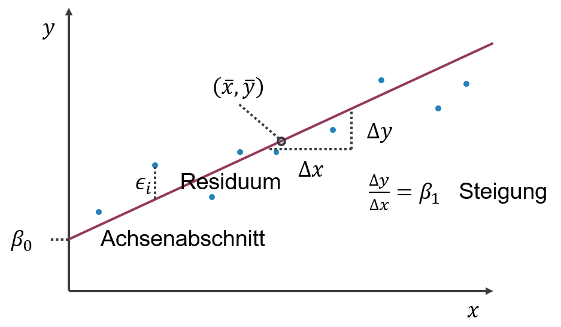

# Lineare Regression {#regression}

Für die lineare Regression kehren wir zu einer Frage aus Kapitel \@ref(korrelation) zurück: _Kann man die Entfernung zu Ihrem Wohnort mit der Anzahl Stationen, die Sie bis Adlershof brauchen statistisch vorhersagen?_

```{r include=FALSE}
# Paket laden, das für das Einlesen von xlsx gebraucht wird
library("readxl")
# Daten einlesen
reisedat <- read_excel("data/Daten_Distanz_Stationen.xlsx")
# in Zahlen und data.frame umwandeln
reisedat <- as.data.frame(apply(reisedat,2,as.numeric))
# 0 mit NA ersetzen
reisedat$stationen[reisedat$stationen == 0] <- NA
```
```{r echo=TRUE}
plot(reisedat$stationen, reisedat$distanz, xlab="Anzahl Stationen", ylab="Entfernung (km)")
```

Wir erinnern uns, dass der Korrelationskoeffizient nach Bravais-Pearson aus Kapitel \@ref(korrelation) 0.81 war. Das Ziel ist nun, eine Gerade durch die Punktwolke zu legen, die den *Trend* beschreibt, so dass der Abstand der Punkte von der Geraden minimal ist.

Es geht um *2 Variablen* (Merkmale):

- die **abhängige Variable** $y$ (im Bsp. Entfernung)
- die **unabhängige Variable** $x$ (im Bsp. Anzahl Stationen)

Die Variablen müssen *metrisch* skaliert sein.^[Das ist korrekt wenn wir von linearer Regression im engen Sinn sprechen, obwohl Regressionsprobleme mit nominal oder ordinal skalierten unabhängigen Variablen mathematisch identisch sind. Auch Regressionsprobleme mit nominal oder ordinal skalierten abhängigen Variablen sind mathematisch ähnlich. Das wird im Masterstudiengang _Global Change Geography_ gelehrt.] Wir wollen das generelle Verhalten von $y$ mit $x$ beschreiben. Eine Gerade stellt dabei das einfachste lineare Modell dar.

## Definitionen

Im Falle einer einzigen unabhängigen Variable lautet die Gleichung des **linearen Models**:

$$\begin{equation}
y_i = \beta_0 + \beta_1 \cdot x_i + \epsilon_i \quad \text{mit} \quad i=1,2,\ldots,n
(\#eq:linmodsingle)
\end{equation}$$

$y_i$ bezeichnet den Wert der **abhängigen Variable** für Datenpunkt $i$, und $x_i$ den Wert der **unabhängigen Variable** für Datenpunkt $i$. Der Parameter $\beta_0$ beschreibt den **Achsenabschnitt** der Geraden, also der Punkt an dem die Gerade die y-Achse schneidet. Der Parameter $\beta_1$ beschreibt die **Steigung** der Geraden. $\epsilon_i$ stellt das **Residuum** (also den Fehler) für Datenpunkt $i$ dar (Abbildung \@ref(fig:linreg)).

```{r linreg, echo=FALSE, fig.align='center', fig.cap='Lineare Regression: Definitionen.'}

```

## Beschreibung vs. Vorhersage

Der primäre Zweck einer Regressionsanalyse ist die Beschreibung (oder Erklärung) der Daten im Sinne einer allgemeinen Beziehung, die sich auf die Grundgesamtheit übertragen lässt, aus der diese Daten entnommen wurden. Da diese Beziehung eine Eigenschaft der Grundgesamtheit ist, sollte sie auch Vorhersagen ermöglichen. Hierbei ist jedoch Vorsicht geboten. Betrachten Sie den Zusammenhang von Jahr und Weltrekordzeit für die in Abbildung \@ref(fig:mile) dargestellten Daten (Meile, Herren). Wenn, wie hier, die Zeit die unabhängige Variable ist, wird die Regression zu einer Form der Trendanalyse, die in diesem Fall eine Verringerung der Rekordzeit mit den Jahren anzeigt. (Die `lm()` Funktion und ihren Output werden wir weiter unten kennenlernen, hier geht es um die Grafiken.)

```{r echo=TRUE}
# Daten laden
mile <- read.csv("https://raw.githubusercontent.com/avehtari/ROS-Examples/master/Mile/data/mile.csv", header=TRUE)
# lineares Modell an Daten aus 1. Hälfte des 20. Jahrh. anpassen
mile_fit1 <- lm(seconds ~ year, data = mile[mile$year<1950,])
# Informationen zu Parameterschätzern extrahieren
coef(summary(mile_fit1))
# lineares Modell an kompletten Datensatz anpassen
mile_fit2 <- lm(seconds ~ year, data = mile)
coef(summary(mile_fit2))
```

```{r mile, echo=TRUE, fig.align='center', fig.cap= 'Links: Trend des Weltrekords "Meile, Herren" in der ersten Hälfte des 20. Jahrhunderts (Beschreibung). Mitte: Extrapolation des Trends für die zweite Hälfte des 20. Jahrhunderts (Vorhersage). Rechts: Extrapolation des Trends bis zum Jahr 2050 (längere Vorhersage). Nach: @wainer2009', fig.show='hold', out.width='33%'}
# Modellanpassung für 1. Hälfte des 20. Jahrh. plotten
plot(mile$year[mile$year<1950], mile$seconds[mile$year<1950],
     xlim = c(1900, 2000), ylim = c(200, 260),
     pch = 19, type = 'p',
     xlab = "Jahr", ylab = "Weltrekord, Meile, Herren (Sekunden)")
abline(coef(mile_fit1), lwd = 3, col = "red")
# Extrapolation für 2. Hälfte des 20. Jahrh. plotten
plot(mile$year, mile$seconds,
     xlim = c(1900, 2000), ylim = c(200, 260),
     pch = 19, type = 'p',
     xlab = "Jahr", ylab = "Weltrekord, Meile, Herren (Sekunden)")
abline(coef(mile_fit1), lwd = 3, col = "red")
# Modellanpassung für Gesamtdaten bis 2050 plotten
plot(mile$year, mile$seconds,
     xlim = c(1900, 2050), ylim = c(200, 260),
     pch = 19, type = 'p',
     xlab = "Jahr", ylab = "Weltrekord, Meile, Herren (Sekunden)")
abline(coef(mile_fit2), lwd = 3, col = "red")
```

Wir sehen, dass sich der Weltrekord in der ersten Hälfte des 20. Jahrhunderts linear verbesserte (Abbildung \@ref(fig:mile), links). Dieser Trend passt auch für die zweite Hälfte des 20. Jahrhunderts bemerkenswert gut (Abbildung \@ref(fig:mile), Mitte). Wie lange kann sich der Weltrekord jedoch noch mit der gleichen Rate verbessern (Abbildung \@ref(fig:mile), rechts)?

Dieses Beispiel zeigt deutlich die Anwendbarkeit von Regressionen für Vorhersagen innerhalb bestimmter Grenzen, zeigt jedoch gleichzeitig die Grenzen dieser einfachen Modelle für längere Vorhersagen (z.B. in Zeit und Raum). Im Falle des Weltrekords würden wir erwarten, dass die Verbesserungsrate mit der Zeit abnimmt, d.h. dass die Kurve abflacht, was ein nichtlineares Modell erfordert.

## Ausblick: Weiterführende lineare Modelle

Wenn wir über das lineare Modell sprechen, ist die abhängige Variable immer metrisch skaliert, während die unabhängigen Variablen metrisch, nominal/ordinal oder gemischt sein können. Im Prinzip kann jede dieser Varianten mathematisch gleich behandelt werden, d.h. alle können z.B. mit der `lm()` Funktion in _R_ analysiert werden. Allerdings haben sich historisch gesehen unterschiedliche Bezeichnungen für diese Varianten etabliert, die hier erwähnt werden sollen, um Verwirrung zu vermeiden (Tabellen \@ref(tab:varianten1) und \@ref(tab:varianten2)).

| unabhängige Variable(n)<br>metrisch | unabhängige Variable(n)<br>nominal/ordinal | unabhängige Variable(n)<br>gemischt |
| :---: | :---: | :---: |
| Regression | Varianzanalyse<br>(ANOVA) | Kovarianzanalyse<br>(ANCOVA) |
Table: (\#tab:varianten1) Historische Namen für die Varianten des linearen Modells, je nachdem, ob die unabhängigen Variablen metrisch, nominal/ordinal oder gemischt sind. Die abhängige Variable ist immer metrisch skaliert.

| | 1 unabhängige Variable  | >1 unabhängige Variable |
| :---: | :---: | :---: |
| **1 abhängige Variable** | Regression  | Multiple Regression |
| **>1 abhängige Variable** | Multivariate Regression | Multivariate multiple Regression|
Table: (\#tab:varianten2) Historische Namen für Regression, je nachdem, ob wir eine oder mehrere unabhängige Variablen und eine oder mehrere abhängige Variablen haben.

## Lineare Regression

Wie soll nun die Gerade durch die Punktwolke gelegt werden, d.h. welche Werte sollen Achsenabschnitt $\beta_0$ und Steigung $\beta_1$ annehmen? Typischerweise werden Regressionsprobleme gelöst, indem die Summe der quadratischen Abweichungen zwischen der Regressionsgeraden und den Datenpunkten minimiert wird - die sogenannte **Kleinste-Quadrate-Schätzung**.

Die Summe der quadratischen Abweichungen wird auch als $SSE$ bezeichnet (Sum of Squared Errors). Grafisch gesehen probieren wir in Abbildung \@ref(fig:linreg) verschiedene Geraden mit unterschiedlichen Achsenabschnitten $\beta_0$ und Steigungen $\beta_1$ aus und wählen diejenige, bei der die Summe aller vertikalen Abstände $\epsilon_i$ zum Quadrat am kleinsten ist. Mathematisch ist $SSE$ definiert als:

$$\begin{equation}
SSE=\sum_{i=1}^{n}\left(\epsilon_i\right)^2=\sum_{i=1}^{n}\left(y_i-\left(\beta_0+\beta_1 \cdot x_i\right)\right)^2
(\#eq:sse)
\end{equation}$$

Das Residuum $\epsilon_i$ ist also gleich $y_i-\left(\beta_0+\beta_1 \cdot x_i\right)$, dem vertikalen Abstand zwischen Datenpunkt und Regressionsgerade.

Im Fall der linearen Regression kann $SSE$ analytisch minimiert werden, was z.B. bei nichtlinearen Modellen nicht der Fall ist. Analytisch finden wir das Minimum von $SSE$ wo dessen partielle Ableitungen in Bezug auf die beiden Modellparameter beide Null sind: $\frac{\partial SSE}{\partial \beta_0}=0$ und $\frac{\partial SSE}{\partial \beta_1}=0$. Unter Anwendung der Definition von $SEE$ aus Gleichung \@ref(eq:sse) und der Summenregel^[Summenregel: wenn $y=u(t) \pm v(t)$ dann $\frac{dy}{dt}=\frac{du}{dt} \pm \frac{dv}{dt}$] und der Kettenregel^[Kettenregel: wenn $y=f[g(t)]$ dann $\frac{dy}{dt}=\frac{df[g]}{dg} \cdot \frac{dg}{dt}$, d.h. "äußere mal innere Ableitung"], die Sie noch aus der Schule kennen werden, erhalten wir:

$$\begin{equation}
\frac{\partial SSE}{\partial \beta_0}=-2 \cdot \sum_{i=1}^{n}\left(y_i-\beta_0-\beta_1 \cdot x_i\right)=0
(\#eq:sseb0)
\end{equation}$$
$$\begin{equation}
\frac{\partial SSE}{\partial \beta_1}=-2 \cdot \sum_{i=1}^{n}x_i \cdot \left(y_i-\beta_0-\beta_1 \cdot x_i\right)=0
(\#eq:sseb1)
\end{equation}$$

Gleichungen \@ref(eq:sseb0) und \@ref(eq:sseb1) bilden ein Gleichungssystem mit zwei Gleichungen und zwei Unbekannten, das wir eindeutig lösen können. Zuerst lösen wir Gleichung \@ref(eq:sseb0) nach $\beta_0$ auf (nachdem wir durch -2 geteilt haben):

$$\begin{equation}
\sum_{i=1}^{n}y_i-n \cdot \beta_0-\beta_1 \cdot \sum_{i=1}^{n}x_i=0
(\#eq:b01)
\end{equation}$$
$$\begin{equation}
n \cdot \beta_0=\sum_{i=1}^{n}y_i-\beta_1 \cdot \sum_{i=1}^{n}x_i
(\#eq:b02)
\end{equation}$$
$$\begin{equation}
\beta_0=\bar{y}-\beta_1 \cdot \bar{x}
(\#eq:b03)
\end{equation}$$

Formal sind das jetzt Parameter*schätzer* (das "Dach"-Symbol bezeichnet Schätzer):
$$\begin{equation}
\hat\beta_0=\bar{y}-\hat\beta_1 \cdot \bar{x}
(\#eq:b04)
\end{equation}$$

Sodann setzen wir Gleichung \@ref(eq:b04) in Gleichung \@ref(eq:sseb1) ein (nachdem wir durch -2 geteilt haben):

$$\begin{equation}
\sum_{i=1}^{n}\left(x_i \cdot y_i-\beta_0 \cdot x_i-\beta_1 \cdot x_i^2\right)=0
(\#eq:insert1)
\end{equation}$$
$$\begin{equation}
\sum_{i=1}^{n}\left(x_i \cdot y_i-\bar{y} \cdot x_i+\hat\beta_1 \cdot \bar{x} \cdot x_i-\hat\beta_1 \cdot x_i^2\right)=0
(\#eq:insert2)
\end{equation}$$

Schließlich lösen wir Gleichung \@ref(eq:insert2) nach $\beta_1$ auf:

$$\begin{equation}
\sum_{i=1}^{n}\left(x_i \cdot y_i-\bar{y} \cdot x_i\right)-\hat\beta_1 \cdot \sum_{i=1}^{n}\left(x_i^2-\bar{x} \cdot x_i\right)=0
(\#eq:b11)
\end{equation}$$
$$\begin{equation}
\hat\beta_1=\frac{\sum_{i=1}^{n}\left(x_i \cdot y_i-\bar{y} \cdot x_i\right)}{\sum_{i=1}^{n}\left(x_i^2-\bar{x} \cdot x_i\right)}
(\#eq:b12)
\end{equation}$$

Über eine Reihe von Schritten, die ich hier überspringe, erhalten wir:

$$\begin{equation}
\hat\beta_1=\frac{SSXY}{SSX}
(\#eq:b13)
\end{equation}$$

$SSX=\sum_{i=1}^{n}\left(x_i-\bar{x}\right)^2$ ist ein Maß für die Varianz der Daten in $x$-Richtung. $SSXY=\sum_{i=1}^{n}\left(x_i-\bar{x}\right) \cdot \left(y_i-\bar{y}\right)$ ist ein Maß für die Kovarianz der Daten. Es gibt auch $SSY=\sum_{i=1}^{n}\left(y_i-\bar{y}\right)^2$, das entsprechend ein Maß für die Varianz der Daten in $y$-Richtung ist. Gleichung \@ref(eq:b13) ist eine exakte Lösung für $\hat\beta_1$.

Wir setzen nun Gleichung \@ref(eq:b13) in Gleichung \@ref(eq:b04) ein und haben eine exakte Lösung für $\hat\beta_0$. Berechnen wir nun die Parameter für unsere Reisedaten mit der `lm()` Funktion:

```{r echo=TRUE}
# lineare Regression der Reisedaten
reise_fit <- lm(distanz ~ stationen, data = reisedat)
# Informationen über geschätzte Parameterwerte ausgeben
coef(summary(reise_fit))
```
In der ersten Spalte ("Estimate") dieses Outputs finden Sie die Werte der Parameterschätzer, wobei "(Intercept)" für $\beta_0$ steht und "stationen" für $\beta_1$. Anhand von $\beta_1$ können wir ablesen, dass die Entfernung zwischen zwei Stationen im Mittel 0.7 km beträgt. Der Achsenabschnitt $\beta_0$ hat keine direkte Entsprechung.^[Wenn wir jedoch die unabhängige Variable "stationen" zentrieren würden, d.h. von allen Datenpunkten den Mittelwert abziehen würden, dann ergäbe sich ein Achsenabschnitt, der die Entfernung für die mittlere Anzahl Stationen darstellen würde.] Auf die anderen Spalten werden wir weiter unten zu sprechen kommen. Plotten wir nun die so ermittelte Regressionsgerade $y_i=4.9+0.7\cdot x_i+\epsilon_i$:

```{r echo=TRUE}
# Modellanpassung plotten
plot(reisedat$stationen, reisedat$distanz,
     pch = 19, type = 'p',
     xlab = "Anzahl Stationen", ylab = "Entfernung (km)")
abline(coef(reise_fit), lwd = 3, col = "red")
```

## Signifikanz der Regression

Nun, da wir Werte für die Regressionsparameter haben, müssen wir uns fragen, ob diese Werte statistisch signifikant sind oder ob sie durch Zufall aus dem (angenommenen) Zufallsprozess der Stichprobenziehung entstanden sein könnten. Dazu testen wir formal, ob die vom Modell erklärte Varianz in den Daten signifikant größer als die nicht erklärte Varianz ist. Das ist ein F-Test-Problem (vgl. Kapitel \@ref(ftest)), das wir über die sogenannte Varianzanalyse (ANOVA) angehen. ANOVA beginnt mit der Erstellung der ANOVA-Tabelle (Tabelle \@ref(tab:anova)). Dies geschieht in _R_ im Hintergrund und wird selten explizit betrachtet; tun wir es hier aber trotzdem, damit wir verstehen was passiert.

| Varianz-<br>quelle | Quadrat-<br>summe | Freiheits-<br>grad ($df$) | Varianz | F-Statistik ($F_s$) | p-Wert |
| :---: | :---: | :---: | :---: | :---: | :---: |
| Regression | $SSR=\\SSY-SSE$ | $1$ | $\frac{SSR}{df_{SSR}}$ | $\frac{\frac{SSR}{df_{SSR}}}{s^2}$ | $1-F\left(F_s,1,n-2\right)$ |
| Fehler | $SSE$ | $n-2$ | $\frac{SSE}{df_{SSE}}=s^2$ | | |
| Gesamt | $SSY$ | $n-1$ | | | |
Table: (\#tab:anova) ANOVA-Tabelle der linearen Regression.

Schauen wir uns zunächst die zweiten Spalte der Tabelle \@ref(tab:anova) an: $SSY=\sum_{i=1}^{n}\left(y_i-\bar{y}\right)^2$ ist ein Maß für die Gesamtvarianz der Daten (in $y$-Richtung), d.h. wie stark die Datenpunkte um den Gesamtmittelwert streuen (Abbildung \@ref(fig:ssysse), links). $SSE=\sum_{i=1}^{n}\left(\epsilon_i\right)^2=\sum_{i=1}^{n}\left(y_i-\left(\beta_0+\beta_1 \cdot x_i\right)\right)^2$ ist ein Maß für die Fehlervarianz, d.h. wie stark die Datenpunkte um die Regressionsgerade streuen (Abbildung \@ref(fig:ssysse), rechts). Das ist die Varianz, die nach der Modellanpassung übrig ist ("nicht erklärt"). $SSR=SSY-SSE$ ist folglich ein Maß für die vom Modell erklärte Varianz.

```{r ssysse, echo=FALSE, fig.align='center', fig.cap='Variation der Datenpunkte um den Mittelwert, zusammengefasst durch $SSY$ (links), und um die Regressionsgerade, zusammengefasst durch $SSE$ (rechts).', fig.show='hold', out.width='50%'}
knitr::include_graphics(c('figs/ssy.jpg','figs/sse.jpg'))
```

In der dritten Spalte der Tabelle \@ref(tab:anova) stehen die Freiheitsgrade der drei Varianzterme. Diese können als Anzahl der Werte in einer Stichprobe, die für die Berechnung der jeweiligen Parameter frei zur Verfügung stehen, verstanden werden (vgl. Kapitel \@ref(streuung)): In die Berechnung von $SSY$ geht $\bar y$ ein, für dessen Berechnung die Werte der Stichprobe bereits einmal verwendet wurden; dadurch ist die Anzahl Freiheitsgrade $df_{SSY}=n-1$. In die Berechnung von $SSE$ gehen $\beta_0$ und $\beta_1$ ein (Gleichung \@ref(eq:sse)), d.h. die Anzahl Freiheitsgrade ist $df_{SSE}=n-2$. Für $SSR$ gilt dann einfach $df_{SSR}=df_{SSY}-df_{SSE}=1$. Die Freiheitsgrade werden verwendet, um die Varianzterme in der vierten Spalte der Tabelle \@ref(tab:anova) zu normalisieren, wobei $s^2$ Fehlervarianz genannt wird.

In der fünften Spalte der Tabelle \@ref(tab:anova) finden wir das Verhältnis von zwei Varianzen; Regressionsvarianz über Fehlervarianz. Von einer signifikanten Regression erwarten wir, dass die (durch das Modell erklärte) Regressionsvarianz viel größer ist als die (durch das Modell nicht erklärte) Fehlervarianz. Dies ist ein F-Test Problem, bei dem getestet wird, ob sich die durch das Modell _erklärte_ Varianz **signifikant** von der durch das Modell _nicht erklärten_ Varianz unterscheidet. Das Verhältnis der beiden Varianzen dient als F-Statistik $F_s$ (vgl. Kapitel \@ref(ftest)).

Die sechste Spalte der Tabelle \@ref(tab:anova) gibt dann den p-Wert des F-Tests an, d.h. die Wahrscheinlichkeit, $F_s$ oder einen größeren Wert (d.h. **ein noch besseres Modell**) zufällig zu erhalten, wenn die Nullhypothese $H_0$ wahr ist (vgl. Kapitel \@ref(ftest)). Im Fall der linearen Regression ist $H_0:\frac{SSR}{df_{SSR}}=s^2$, d.h. die beiden Varianzen sind gleich, und $H_1:\frac{SSR}{df_{SSR}}>s^2$, d.h. die erklärte Varianz ist größer als die nicht erklärte.

Wie in Kapitel \@ref(ftest) bereits diskutiert folgt $F_s$ einer F-Verteilung unter der Nullhypothese, hier mit den Parametern $1$ und $n-2$ (Abbildung \@ref(fig:fcdf)). Die blaue Linie in Abbildung \@ref(fig:fcdf) markiert einen bestimmten Wert von $F_s$ (hier 8) und den entsprechenden Wert der Verteilungsfunktion der F-Verteilung ($F\left(F_s,1,n-2\right)$). Der p-Wert ist $\Pr\left(Z> F_s\right)=1-F\left(F_s,1,n-2\right)$ und beschreibt die Wahrscheinlichkeit, dieses oder ein größeres Varianzverhältnis zufällig (aufgrund der zufälligen Stichprobenziehung) zu erhalten, selbst wenn die beiden Varianzen tatsächlich gleich sind.
```{r fcdf, echo=FALSE, fig.align='center', fig.cap='Verteilungsfunktion der F-Verteilung der F-Statistik $F_s$. Blau: Bestimmter Wert für $F_s$ und entsprechender Wert der Verteilungsfunktion.', out.width='80%'}
plot(seq(0,15,0.1), pf(seq(0,15,0.1), 1, 71), ylim=c(0,1), type='l',
     xlab='Z=F_s', ylab='Verteilungsfunktion')
lines(c(1, 1)*8, c(0, pf(8, 1, 71)), col='blue')
lines(c(0, 8), c(1, 1)* pf(8, 1, 71), col='blue')
text(8,-0.2,"F_s", col="blue", xpd=TRUE)
```

Für die Regression der Reisedaten ist der p-Wert wesentlich kleiner als das konventionelle Signifikanzniveau $\alpha=0.01$, daher lehnen wir die die Nullhypothese ab und bezeichnen die Regression als statistisch signifikant. Schauen wir uns die ANOVA-Tabelle fuer das Beispiel an:
```{r echo=TRUE}
anova(reise_fit)
```
Im Vergleich zu Tabelle \@ref(tab:anova) lässt _R_ die letzte Zeile ($SSY$) weg und tauscht die Spalten "Quadratsumme" und "Freiheitsgrad".

## Konfidenzintervalle und Signifikanz der Parameter

Da die Modellanpassung nicht perfekt ist, haben die Parameterschätzer Standardfehler, d.h. sie werden wie andere statistische Kennzahlen als Realisationen eines Zufallsprozesses interpretiert. Das führt uns zu Konfidenzintervallen und t-Tests auf Signifikanz der einzelnen Parameter.

Der **Standardfehlern** für $\hat\beta_0$ ist:
$$\begin{equation}
s_{\hat\beta_0}=\sqrt{\frac{\sum_{i=1}^{n}x_i^2}{n} \cdot \frac{s^2}{SSX}}
(\#eq:seb0)
\end{equation}$$

Wenn wir diese Formel in ihre einzelnen Teile zerlegen, sehen wir: Je mehr Datenpunkte $n$ wir haben, desto kleiner ist der Standardfehler, d.h. desto mehr Vertrauen haben wir in die Schätzung. Außerdem gilt, je größer die Variation in $x$ ($SSX$), desto kleiner der Standardfehler. Beide Effekte machen intuitiv Sinn: Je mehr Datenpunkte wir haben und je mehr Ausprägungen von $x$ wir abgedeckt haben, desto sicherer können wir sein, dass unsere Stichprobe repräsentativ für die Grundgesamtheit ist. Umgekehrt gilt: Je größer die Fehlervarianz $s^2$, d.h. je kleiner die Erklärungskraft unseres Modells, desto größer der Standardfehler. Und je mehr $x$-Datenpunkte von Null entfernt sind, d.h. je größer $\sum_{i=1}^{n}x_i^2$, desto geringer ist unser Vertrauen in den Achsenabschnitt (wo $x=0$ ist) und damit steigt der Standardfehler.

Der Standardfehler für $\hat\beta_1$ ist:
$$\begin{equation}
s_{\hat\beta_1}=\sqrt{\frac{s^2}{SSX}}
(\#eq:seb1)
\end{equation}$$
Hier gilt die gleiche Interpretation wie zuvor, außer dass es keinen Einfluss der Größe der $x$-Datenpunkte gibt.

Wir können auch einen Standardfehler für neue Vorhersagen $\hat y$ für gegebene $\hat x$ festlegen:
$$\begin{equation}
s_{\hat y}=\sqrt{s^2 \cdot \left(\frac{1}{n}+\frac{\left(\hat x-\bar x\right)^2}{SSX}\right)}
(\#eq:sey)
\end{equation}$$

Dieselbe Interpretation gilt auch hier, nur dass jetzt ein zusätzlicher Term $\left(\hat x-\bar x\right)^2$ auftaucht, der besagt, je weiter der neue $x$-Wert vom Zentrum der ursprünglichen Daten (den Trainings- oder Kalibrierungsdaten) entfernt ist, desto größer ist der Standardfehler der neuen Vorhersage, d.h. desto geringer ist die Zuversicht, dass sie korrekt ist.

Anmerkung: Die Formeln für die Standardfehler ergeben sich aus den grundlegenden Annahmen der linearen Regression, auf die wir weiter unten eingehen werden. Die mathematische Herleitung lassen wir hier aus.

Aus den Standardfehlern können wir **Konfidenzintervalle** für die Parameterschätzer wie folgt berechnen (vgl. Konfidenzintervall des Mittelwertschätzers (Kapitel \@ref(schaetzen))):
$$\begin{equation}
\Pr\left(\hat\beta_0-t_{n-2;0.975} \cdot s_{\hat\beta_0}\leq \beta_0\leq \hat\beta_0+t_{n-2;0.975} \cdot s_{\hat\beta_0}\right)=0.95
(\#eq:cib01)
\end{equation}$$

Gleichung \@ref(eq:cib01) ist das zentrale 95%-Konfidenzintervall, in dem der wahre Parameterwert, hier $\beta_0$, mit einer Wahrscheinlichkeit von 0.95 liegt.^[Wahrscheinlichkeit heisst hier wieder, dass bei wiederholtem Stichprobenziehen in 95% der Fälle das so konstruierte Konfidenzintervall den wahren Wert $\beta_0$ umschließt und in 5% der Fälle nicht.]

Wir können das Intervall auch wie folgt schreiben:
$$\begin{equation}
KI=\left[\hat\beta_0-t_{n-2;0.975} \cdot s_{\hat\beta_0};\hat\beta_0+t_{n-2;0.975} \cdot s_{\hat\beta_0}\right]
(\#eq:cib02)
\end{equation}$$

Wie bei dem Konfidenzintervall des Mittelwertschätzers (Kapitel \@ref(schaetzen)) liegt das Konfidenzintervall symmetrisch um den Parameterschätzwert $\hat\beta_0$ und ergibt sich aus einer t-Verteilung mit dem Parameter $n-2$, deren Breite durch den Standardfehler $s_{\hat\beta_0}$ moduliert wird. Erinnern Sie sich, dass die Breite der t-Verteilung ebenfalls durch den Stichprobenumfang kontrolliert wird und mit zunehmendem $n$ immer schmaler wird.

Die gleichen Formeln gelten für $\beta_1$ und $y$:
$$\begin{equation}
\Pr\left(\hat\beta_1-t_{n-2;0.975} \cdot s_{\hat\beta_1}\leq \beta_1\leq \hat\beta_1+t_{n-2;0.975} \cdot s_{\hat\beta_1}\right)=0.95
(\#eq:cib1)
\end{equation}$$
$$\begin{equation}
\Pr\left(\hat y-t_{n-2;0.975} \cdot s_{\hat y}\leq y\leq \hat y+t_{n-2;0.975} \cdot s_{\hat y}\right)=0.95
(\#eq:ciy)
\end{equation}$$

Die Formeln für die Konfidenzintervalle (Gleichungen \@ref(eq:cib01), \@ref(eq:cib1) und \@ref(eq:ciy)) ergeben sich aus den Grundannahmen der linearen Regression (vgl. Kapitel \@ref(schaetzen)): Die Residuen sind _unabhängig identisch verteilt (u.i.v.)_ gemäß einer _Normalverteilung_, d.h. $\epsilon_i\sim N(0,\sigma)$, und _das lineare Modell ist korrekt_. Dann lässt sich mathematisch zeigen, dass $\frac{\hat\beta_0-\beta_0}{s_{\hat\beta_0}}$, $\frac{\hat\beta_1-\beta_1}{s_{\hat\beta_1}}$ und $\frac{\hat y-y}{s_{\hat y}}$ $t_{n-2}$-verteilt sind (t-Verteilung mit $n-2$ Freiheitsgraden). Da das zentrale 95%-Konfidenzintervall einer $t_{n-2}$-verteilten Zufallsvariablen $Z$ $\Pr\left(-t_{n-2;0.975}\leq Z\leq t_{n-2;0. 975}\right)=0.95$ ist (Abbildung \@ref(fig:kiz)), können wir jeden der oben genannten drei Terme für $Z$ einsetzen und die Ungleichung umstellen, um zu den Gleichungen \@ref(eq:cib01), \@ref(eq:cib1) und \@ref(eq:ciy) zu gelangen.

Die Signifikanz der Parameterschätzer wird mit Hilfe eines t-Tests ermittelt (vgl. Kapitel \@ref(ttest)). Die **Nullhypothese** ist, dass die wahren Parameterwerte gleich Null sind, d.h. die Parameterschätzer _nicht_ signifikant sind:
$$\begin{equation}
H_0:\beta_0=0
(\#eq:h0b0)
\end{equation}$$
$$\begin{equation}
H_0:\beta_1=0
(\#eq:h0b1)
\end{equation}$$

Diese Hypothese wird gegen die **Alternativhypothese** getestet, dass die wahren Parameterwerte *un*gleich Null sind, d.h. dass die Parameterschätzer signifikant sind:
$$\begin{equation}
H_1:\beta_0\neq 0
(\#eq:h1b0)
\end{equation}$$
$$\begin{equation}
H_1:\beta_1\neq 0
(\#eq:h1b1)
\end{equation}$$

Die Teststatistiken sind:
$$\begin{equation}
t_s=\frac{\hat\beta_0-0}{s_{\hat\beta_0}}\sim t_{n-2}
(\#eq:tsb0)
\end{equation}$$
$$\begin{equation}
t_s=\frac{\hat\beta_1-0}{s_{\hat\beta_1}}\sim t_{n-2}
(\#eq:tsb1)
\end{equation}$$

Die t-Verteilungen der Teststatistiken ergeben sich wiederum aus den oben erwähnten Regressionsannahmen. Die Annahmen sind die gleichen wie beim üblichen t-Test der Mittelwerte (Kapitel \@ref(ttest)), außer dass im Fall der linearen Regression die Residuen als u.i.v. normal angenommen werden, während im Fall der Mittelwerte die tatsächlichen Datenpunkte $y$ als u.i.v. normal angenommen werden.

Analog zum üblichen 2-seitigen t-Test ist der p-Wert definiert als:
$$\begin{equation}
2 \cdot \Pr\left(t>|t_s|\right)=2 \cdot \left(1-F_t\left(|t_s|\right)\right)
(\#eq:pv)
\end{equation}$$

Mit einem konventionellen Signifikanzniveau von $\alpha=0.01$ gelangen wir zu einem kritischen Wert der Teststatistik $t_c=t_{n-2;0.995}$, bei dessen Überschreitung, bzw. Unterschreitung von $-t_c$, wir die Nullhypothese ablehnen und die Parameterschätzer als signifikant bezeichnen.

Jetzt verstehen wir auch die restlichen Informationen des Outputs der `lm()` Funktion (s. oben):
```{r echo=TRUE}
coef(summary(reise_fit))
```
Wie bereits oben erwähnt steht die Zeile "(Intercept)" für $\beta_0$ und die Zeile "stationen" für $\beta_1$. In Spalte "Estimate" stehen die Werte der Parameterschätzer. In Spalte "Std. Error" stehen deren Standardfehler (Gleichungen \@ref(eq:seb0) und \@ref(eq:seb1)). In Spalte "t value" stehen die entsprechenden Werte der Teststatistik (Gleichungen \@ref(eq:tsb0) und \@ref(eq:tsb1)). In Spalte "Pr(>|t|)" stehen die p-Werte der t-Tests auf Signifikanz der Parameter (Gleichung \@ref(eq:pv)). Wir sehen, dass in unserem Beispiel beide Parameter signifikant sind (die p-Werte sind wesentlich kleiner als das konventionelle $\alpha=0.01$).

## Güte der Modellanpassung

Die Signifikanz der Parameter der Regression ist eine Sache. Wie gut aber ist das Modell im Beschreiben der Daten? D.h. wieviel von der Varianz in den Daten wird vom Modell erklärt? Die Güte der Modellanpassung kann in erster Linie mit dem **Bestimmtheitsmaß** ($r^2$) begutachtet werden, welches als Anteil der Varianz (in $y$-Richtung) definiert ist, der durch das Modell erklärt wird:
$$\begin{equation}
r^2=\frac{SSY-SSE}{SSY}=1-\frac{SSE}{SSY}
(\#eq:r2)
\end{equation}$$
Das Bestimmtheitsmaß ist der Korrelationskoeffizient nach Bravais-Pearson zum Quadrat (vgl. Kapitel \@ref(korrelation)).

Wie wir an Gleichung \@ref(eq:r2) sehen, wenn das Modell nicht mehr Variation als die Gesamtvariation um den Mittelwert erklärt, d.h. $SSE=SSY$ ist, dann ist $r^2=0$. Umgekehrt, wenn das Modell perfekt zu den Daten passt, d.h. $SSE=0$ ist, dann ist $r^2=1$. Werte dazwischen stellen unterschiedliche Grade der Anpassungsgüte dar. Das kann wiederum mit Abbildung \@ref(fig:ssysse) veranschaulicht werden, wobei der linke Teil $SSY$ und der rechte Teil $SSE$ verdeutlicht.

Wenn es darum geht, Modelle unterschiedlicher Komplexität (d.h. mit mehr oder weniger Parametern) mit $r^2$ zu vergleichen, dann ist es sinnvoll, das Bestimmtheitsmaß mit der Anzahl der Modellparameter zu korrigieren, da komplexere Modelle (mehr Parameter) automatisch zu besseren Anpassungen führen, einfach aufgrund der größeren Freiheitsgrade, die komplexere Modelle bei der Anpassung der Daten haben. Dies führt zum **korrigierten $r^2$**:
$$\begin{equation}
\bar r^2=1-\frac{\frac{SSE}{df_{SSE}}}{\frac{SSY}{df_{SSY}}}=1-\frac{SSE}{SSY} \cdot \frac{df_{SSY}}{df_{SSE}}
(\#eq:adjr2)
\end{equation}$$

Rechnen wir $r^2$ und $\bar r^2$ für die Regression der Reisedaten aus:
```{r echo=TRUE}
summary(reise_fit)$r.squared
summary(reise_fit)$adj.r.squared
```
D.h. rund 65% der Varianz in den Entfernungs-Daten wird durch das lineare Modell mit Anzahl Stationen als Prädiktor erklärt.

Aber was heißt Güte der Modellanpassung? Sind alle Modellannahmen erfüllt? Folgende Annahmen ergeben sich aus der **Maximum-Likelihood-Theorie** (vgl. Schätzen von Verteilungsparametern, Kapitel \@ref(schaetzen)):

- Die Residuen sind **unabhängig**, in diesem Fall gibt es keine serielle Korrelation in der Residuengrafik - dies kann mit dem Durbin-Watson-Test getestet werden
- Die Residuen sind **normalverteilt** - dies kann visuell mit Hilfe des Quantil-Quantil-Diagramms (QQ-Plot) und dem Residuen-Histogramm beurteilt werden, und kann mit dem Kolmogorov-Smirnov-Test (Kapitel \@ref(kstest)) und dem Shapiro-Wilk-Test getestet werden
- Die Varianz ist für alle Residuen konstant (die Residuen sind **homoskedastisch**), d.h. es erfolgt kein "Auffächern" der Residuen

Sind diese Annahmen nicht erfüllt, können wir auf Datentransformation, gewichtete Regression oder Generalisierte Lineare Modelle zurückgreifen. Letzteres ist wird im Master *Global Change Geography* unterrichtet.

Eine erste nützliche diagnostische Darstellung ist die der Residuen in Serie, d.h. nach Index $i$, um zu sehen, ob es ein Muster aufgrund des Datenerfassungsprozesses gibt. Für unser Beispiel:
```{r echo=TRUE}
# Residuen gegen Index plotten
plot(residuals(reise_fit), pch = 19, type = 'p', ylim = c(-25,25))
abline(h = 0, lwd = 3, col = "red")
```

Dieser Datensatz zeigt kein erkennbares Muster, was für eine Unabhängigkeit der Residuen spricht.

Wir sollten auch die Residuen nach dem modellierten Wert von $y$ plotten, um zu sehen, ob es ein Muster als Funktion der Größenordnung von $y$ gibt:
```{r echo=TRUE}
# Residuen gegen modellierte Werte von y plotten
plot(fitted.values(reise_fit),residuals(reise_fit), pch = 19, type = 'p', ylim = c(-25,25))
abline(h = 0, lwd = 3, col = "red")
```

Diese Grafik zeigt eine leichte Zunahme der Residuenvarianz von links nach rechts, d.h. in Richtung größerer Werte - eine Form der Heteroskedastizität.

Die Annahme, dass die Residuen normalverteilt sind, kann anhand des QQ-Plots beurteilt werden (vgl. Kapitel \@ref(qqplot)):
```{r echo=TRUE}
qqnorm(residuals(reise_fit))
qqline(residuals(reise_fit))
```

In unserem Beispiel deutet der QQ-Plot darauf hin, dass die Flanken der Residuenverteilung flacher als bei einer Normalverteilung abfallen, vermutlich aufgrund der o.g. Heteroskedastizität. Das können wir beim Histogramm der Residuen nicht so gut sehen da die Vergleichsverteilung fehlt:
```{r echo=TRUE}
# Histogramm der Residuen plotten
hist(residuals(reise_fit), xlim = c(-25,25))
```

Die Heteroskedastizität würde man angehen, indem man mit einem Generalisierten Linearen Modell eine andere Residuenverteilung als die Normalverteilung annimmt. Das führt aber im Rahmen dieses Kurses zu weit. Es bleibt somit festzuhalten, dass das Regressionsproblem mit den hier behandelten Methoden noch nicht vollständig gelöst ist.
